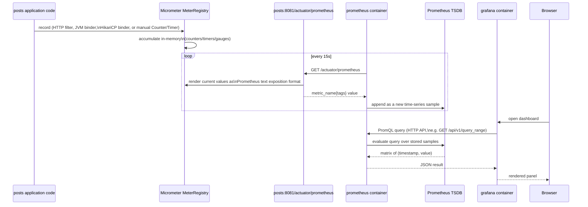
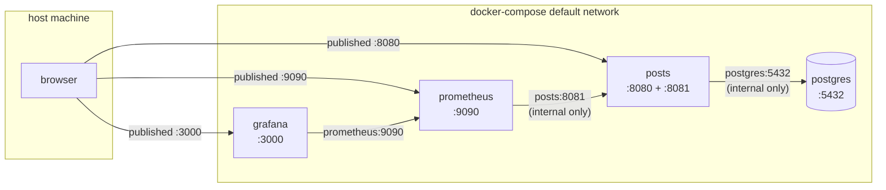

# Monitoring Architecture

How metrics actually get from a line of Java code inside `posts` to a
graph in a browser — the mechanism, not the day-to-day usage. For "how do
I view/query/extend this," see
[`backend/posts/docs/observability.md`](backend/posts/docs/observability.md)
instead; this doc is the "how does it work and connect" companion to that
usage guide, at the same container-orchestration level as
[`OVERALL-ARCHITECTURE.md`](OVERALL-ARCHITECTURE.md).

## Table of Contents

- [1. End-to-End Data Flow](#1-end-to-end-data-flow)
- [2. Inside `posts`: Micrometer](#2-inside-posts-micrometer)
- [3. The Management-Port Split](#3-the-management-port-split)
- [4. Prometheus: the Scraper](#4-prometheus-the-scraper)
- [5. Grafana: the Viewer](#5-grafana-the-viewer)
- [6. Docker Compose Wiring](#6-docker-compose-wiring)
- [7. Config File Map](#7-config-file-map)

## 1. End-to-End Data Flow

[↑ Back to Table of Contents](#table-of-contents)



Three things worth internalizing about this shape:

- **It's pull, not push.** `posts` never initiates a connection to
  Prometheus or Grafana. It just exposes a text endpoint reflecting
  whatever Micrometer currently has in memory; Prometheus is the one
  reaching out, on its own schedule. `posts` would export the exact same
  data whether or not anything is scraping it — the endpoint has no
  awareness of Prometheus's existence.
- **Prometheus, not `posts`, owns history.** Every scrape is a snapshot;
  `posts` doesn't store time series at all, only current counter/gauge
  values (Micrometer's in-memory state resets on restart). All the
  "over the last 5 minutes" math (`rate()`, `histogram_quantile()`) happens
  in Prometheus against what it has already collected, not in the app.
- **Grafana never touches `posts` directly.** It only ever talks to
  Prometheus's HTTP API. If you deleted the `grafana` service entirely,
  scraping and metric retention would be completely unaffected — Grafana
  is purely a query/visualization layer on top of Prometheus's own API.

## 2. Inside `posts`: Micrometer

[↑ Back to Table of Contents](#table-of-contents)

Two dependencies (`backend/posts/pom.xml`) do all of this with zero
application code:

- **`spring-boot-starter-actuator`** — pulls in Micrometer's core
  (`micrometer-core`) plus Spring Boot's auto-configuration, which:
  - Registers a global `MeterRegistry` bean (auto-injectable anywhere —
    see [`observability.md` §4](backend/posts/docs/observability.md#4-adding-your-own-metrics)
    for using it directly).
  - Wraps every servlet request in a filter
    (`WebMvcMetricsAutoConfiguration`) that times it and records it as the
    `http.server.requests` metric, tagged with `uri`, `method`, `status`,
    `outcome` (the `uri` tag uses the *route template*, e.g.
    `/posts/{postId}`, not the literal URL — so `/posts/1` and `/posts/2`
    aggregate into one series instead of exploding into one per ID).
  - Registers JVM binders (`JvmMemoryMetrics`, `JvmGcMetrics`,
    `JvmThreadMetrics`, `ProcessorMetrics`, ...) that poll the JVM's own
    `MemoryMXBean`/`GarbageCollectorMXBean`/etc. on demand.
  - Detects the `HikariDataSource` bean already in the application context
    (used for the `posts` schema connection) and binds its pool stats
    (`HikariCPMetrics`) — this is why HikariCP metrics require zero config
    here specifically; the binder only activates when it finds a
    `HikariDataSource` in the context, which this app already has.
  - Wires up the `/actuator/*` endpoints as a *second* embedded Tomcat
    context, not part of the app's normal DispatcherServlet mapping —
    [§3](#3-the-management-port-split) is entirely about this.
- **`micrometer-registry-prometheus`** — adds a `PrometheusMeterRegistry`
  implementation. Without it, Micrometer would still collect everything
  above into its generic `MeterRegistry`, but there'd be no `/actuator/
  prometheus` endpoint to render it in Prometheus's text format — this
  dependency is specifically the Micrometer → Prometheus translation
  layer, and is what makes `management.prometheus.metrics.export.enabled`
  (implicitly true once this is on the classpath) do anything.

Everything under `management:` in
[`application.yml`](backend/posts/src/main/resources/application.yml)
configures this auto-configuration (which port, which endpoints are web-
exposed, histogram buckets) rather than wiring anything up from scratch.

## 3. The Management-Port Split

[↑ Back to Table of Contents](#table-of-contents)

`management.server.port: 8081` (different from `server.port: 8080`, the
default) makes Spring Boot start a **second embedded Tomcat connector**
inside the same JVM/process — confirmed directly in `posts`' own startup
log:

```
Tomcat started on port 8080 (http) with context path ''       <- the app
Tomcat initialized with port 8081 (http)                      <- actuator
Exposing 3 endpoints beneath base path '/actuator'
Tomcat started on port 8081 (http) with context path ''
```

Same process, same `MeterRegistry`, same JVM — just two independent
listening sockets, each with its own servlet context. That separation is
what has two consequences worth naming explicitly:

- **`SecurityConfig`'s filter chain never sees requests to port 8081.**
  `SecurityFilterChain` beans are wired into the *main* servlet context's
  filter pipeline; the management context is a different
  `ApplicationContext` child entirely. So `anyRequest().permitAll()` in
  `SecurityConfig` has literally no bearing on `/actuator/*` — it's a
  different HTTP server, not just a different URL pattern.
- **Spring Boot's own actuator-security auto-configuration also doesn't
  apply.** When `spring-security` is on the classpath, Spring Boot ships a
  `ManagementWebSecurityAutoConfiguration` that *would* lock down actuator
  endpoints behind HTTP Basic (using the generated password you see in
  `posts`' startup log, printed there for the main app's own unused
  default `UserDetailsService`) — but only when the management port is
  the *same* as the app's. On a different port, that auto-config backs off
  entirely, on the assumption that a different port is already a network
  boundary someone will control deliberately (a firewall, a non-published
  Docker port, a Kubernetes NetworkPolicy) rather than relying on
  in-process auth.

That second point is exactly what
[`docker-compose.yml`](docker-compose.yml) then implements: `posts`'
`ports:` list publishes `8080` to the host but not `8081`. The management
port is reachable only via Docker's internal DNS (`posts:8081`) from
containers on the same compose network — `prometheus`, concretely — and
from nowhere else. Nothing about that is `posts`-specific config; it's
just the absence of a `ports:` entry.

## 4. Prometheus: the Scraper

[↑ Back to Table of Contents](#table-of-contents)

The `prometheus` service ([`docker-compose.yml`](docker-compose.yml))
runs the stock `prom/prometheus` image with one bind-mounted config file:
[`deploy/docker/prometheus/prometheus.yml`](deploy/docker/prometheus/prometheus.yml).
That file's `scrape_configs` is the entire connection to `posts` — a
static target list naming `posts:8081` and the path `/actuator/prometheus`,
polled every 15s (`scrape_interval`). Prometheus resolves `posts` through
Docker Compose's built-in DNS (every service is reachable by its service
name from any other service on the same default network — the same
mechanism `posts` itself uses to reach `postgres:5432`), so no IP
addresses or manual service discovery are involved.

Everything Prometheus collects lands in its own on-disk TSDB (time-series
database), persisted in the `prometheus-data` named volume so history
survives a container restart (`docker compose down`, without `-v`) but not
`docker compose down -v` or `docker-hard-clean.sh`. Retention is capped at
15 days (`--storage.tsdb.retention.time=15d` in the service's `command:`)
— old samples are dropped automatically rather than growing the volume
unbounded.

## 5. Grafana: the Viewer

[↑ Back to Table of Contents](#table-of-contents)

The `grafana` service connects to `prometheus`, never to `posts`. Two
files, both bind-mounted read-only into the container and auto-loaded on
startup (Grafana's own "provisioning" mechanism — no UI click-through,
nothing stored only in the `grafana-data` volume that a fresh clone would
be missing):

- [`deploy/docker/grafana/provisioning/datasources/datasource.yml`](deploy/docker/grafana/provisioning/datasources/datasource.yml)
  registers `http://prometheus:9090` (again, Compose DNS, not an IP) as a
  Prometheus-type datasource with a fixed `uid: prometheus`.
- [`deploy/docker/grafana/provisioning/dashboards/`](deploy/docker/grafana/provisioning/dashboards/)
  contains a dashboard *provider* config plus the actual dashboard JSON
  ([`posts-overview.json`](deploy/docker/grafana/provisioning/dashboards/posts-overview.json)).
  Each panel's `datasource.uid` references that same fixed `"prometheus"`
  uid, which is why the datasource file hardcodes it rather than letting
  Grafana auto-generate one — the dashboard JSON can reference it
  deterministically without a chicken-and-egg lookup step.

When a panel renders, Grafana issues a PromQL query (the panel's `expr`,
e.g. `histogram_quantile(0.95, sum(rate(http_server_requests_seconds_bucket
{job="posts"}[5m])) by (le))`) against Prometheus's HTTP API, gets back a
JSON matrix of timestamps/values, and draws it. Grafana does no metric
computation of its own beyond that — every number on the dashboard is
something Prometheus already computed from stored samples.

## 6. Docker Compose Wiring

[↑ Back to Table of Contents](#table-of-contents)



| Service | Image | Publishes to host | Reaches | Volume |
|---|---|---|---|---|
| `posts` | built locally | `8080` (app) — `8081` (metrics) is **not** published | `postgres:5432` | — |
| `prometheus` | `prom/prometheus:v3.14.0` | `9090` | `posts:8081` | `prometheus-data` (TSDB) |
| `grafana` | `grafana/grafana:13.2.2` | `3000` | `prometheus:9090` | `grafana-data` (Grafana's own settings DB, session state) |

`depends_on` in `docker-compose.yml` orders container *startup*
(`prometheus` after `posts`, `grafana` after `prometheus`) but doesn't
wait for `posts` to be fully ready — Prometheus's own scrape retry loop
(every 15s, indefinitely) is what actually handles `posts` still being
mid-startup, not a compose-level readiness gate.

## 7. Config File Map

[↑ Back to Table of Contents](#table-of-contents)

| File | Controls |
|---|---|
| [`backend/posts/pom.xml`](backend/posts/pom.xml) | Which dependencies exist: actuator, the Prometheus registry, and the `build-info` Maven goal for `/actuator/info` |
| [`backend/posts/src/main/resources/application.yml`](backend/posts/src/main/resources/application.yml) (`management:` block) | Management port, which endpoints are web-exposed, health-probe/histogram behavior |
| [`docker-compose.yml`](docker-compose.yml) | Which services run, which ports reach the host, which volumes persist, container-to-container reachability |
| [`deploy/docker/prometheus/prometheus.yml`](deploy/docker/prometheus/prometheus.yml) | What Prometheus scrapes, how often |
| [`deploy/docker/grafana/provisioning/datasources/datasource.yml`](deploy/docker/grafana/provisioning/datasources/datasource.yml) | Grafana's connection to Prometheus |
| [`deploy/docker/grafana/provisioning/dashboards/posts-overview.json`](deploy/docker/grafana/provisioning/dashboards/posts-overview.json) | What the dashboard actually shows |
| [`.env` / `.env.example`](.env.example) | Host-published ports (`PROMETHEUS_PORT`, `GRAFANA_PORT`) and `GRAFANA_ADMIN_PASSWORD` |
