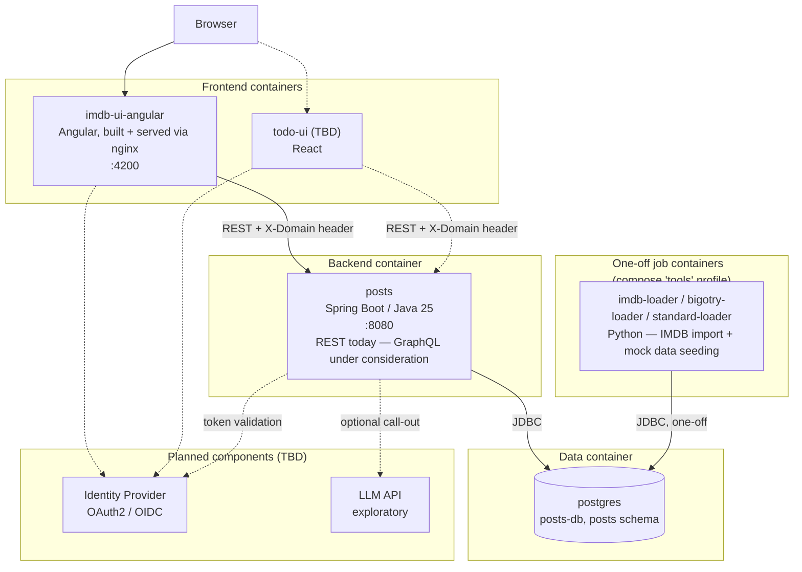
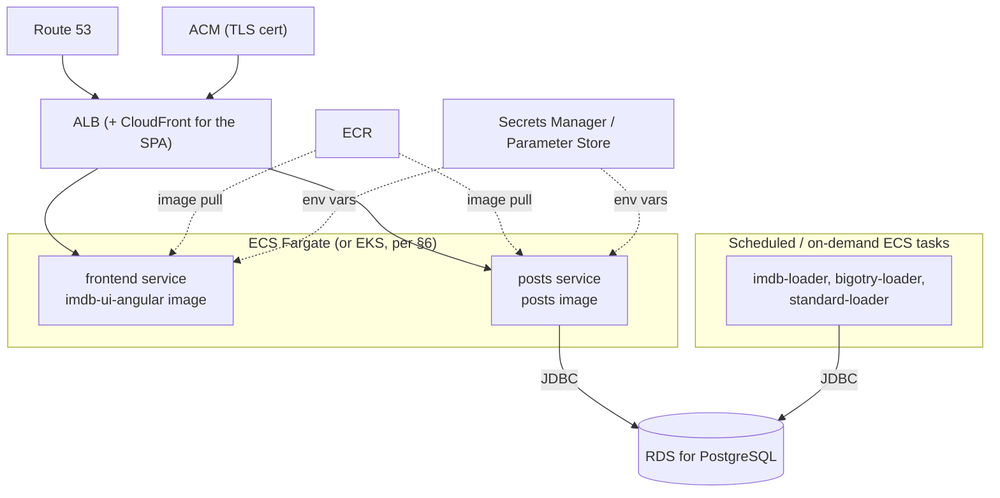

# Overall Architecture

A container-orchestration-level view of this system: what runs, how the
pieces talk to each other, and how the design stays pluggable enough to
add new frontends, domains, and backend capabilities without reworking
what already exists. For code-level detail, see the linked component
documents rather than this one — this document intentionally stays at the
container/service boundary.

## Table of Contents

- [1. System Overview](#1-system-overview)
- [2. Container Topology](#2-container-topology)
- [3. Pluggable Domain Model](#3-pluggable-domain-model)
- [4. Component Documentation](#4-component-documentation)
- [5. AWS Deployment Feasibility](#5-aws-deployment-feasibility)
- [6. Planned Extensions](#6-planned-extensions)

## 1. System Overview

A Spring Boot REST API (`posts`) backed by PostgreSQL, served to one or
more Angular/React single-page frontends, orchestrated today with Docker
Compose on a single host. The defining architectural trait is that the
backend is not built around one fixed dataset or UI — every table,
service call, and endpoint is partitioned by a **domain** concept
resolved from a request header, so unrelated frontends can share the same
backend and database without a schema change. Two domains are live today
(`imdb/bigotry`, `imdb/standard`); [§3](#3-pluggable-domain-model) covers
the mechanism, [§5](#5-aws-deployment-feasibility) covers moving today's
Compose setup onto AWS, and [§6](#6-planned-extensions) covers what's
planned to build on it next.

## 2. Container Topology

Solid lines are running today; dashed lines are planned ([§6](#6-planned-extensions)).

Today's orchestration is a single `docker-compose.yml` at the repo root:

- **Services**: `postgres`, `posts`, `frontend` are long-running and come
  up via `docker compose up`; `imdb-loader`, `bigotry-loader`, and
  `standard-loader` are one-off data-seeding jobs isolated under a
  `tools` compose profile so they never start with the main stack — they
  run explicitly via `docker compose run --rm <job>`.
- **Networking**: services reach each other over Compose's internal
  DNS by service name (`posts` connects to `postgres:5432`, never a
  published host port); only the ports a human or browser needs
  (`4200`, `8080`, and `postgres` at `5433` for direct inspection) are
  published to the host, all overridable from one `.env` file.
- **Images**: both `posts` and `imdb-ui-angular` build as multi-stage
  images (JDK → JRE for the backend; Node → nginx for the frontend),
  keeping the runtime image free of build tooling.
- **Runtime configuration over build-time baking**: the backend reads its
  datasource URL and CORS origin from environment variables via Spring's
  relaxed binding; the frontend's backend URL is written to a
  `/config.json` file by the container's entrypoint script at *startup*,
  not baked into the JS bundle at build time. Either image can be
  redeployed against a different environment with no rebuild — the
  precondition for the same images running under a different orchestrator
  later ([§5](#5-aws-deployment-feasibility), [§6](#6-planned-extensions)).

## 3. Pluggable Domain Model

Every domain-owned table carries (directly or by derivation) a
`domain_id`, and every request declares its domain via an `X-Domain`
header, resolved server-side before anything else runs. Three domain-
owning tables enforce this with composite foreign keys, so a resource,
post, or flag can never reference a row from a different domain — not by
convention, by database constraint. On the frontend, a matching
`DomainConfig` object per domain drives rating behavior, labeling, and
theming from one file, with no per-domain branching scattered through
components.

The practical effect: adding a domain today is a Flyway migration plus,
if it needs a UI, one frontend config file — not a new service and not a
schema change. This is the seam every item in [§6](#6-planned-extensions)
attaches to.

Full mechanism and trade-offs: [`backend/posts/docs/architecture.md`](backend/posts/docs/architecture.md) §8,
[`frontend/imdb-ui-angular/docs/architecture.md`](frontend/imdb-ui-angular/docs/architecture.md) §4.

## 4. Component Documentation

| Component | Role | Docs |
|---|---|---|
| `backend/posts` | REST API, owns the schema (Flyway) | [`architecture.md`](backend/posts/docs/architecture.md), [`design-spec.md`](backend/posts/docs/design-spec.md) |
| `frontend/imdb-ui-angular` | SPA for the `imdb/bigotry` and `imdb/standard` domains | [`architecture.md`](frontend/imdb-ui-angular/docs/architecture.md), [`design-spec.md`](frontend/imdb-ui-angular/docs/design-spec.md), [`user-guide.md`](frontend/imdb-ui-angular/docs/user-guide.md) |
| `backend/imdb-data-python` | One-off IMDB import + mock-data seeding jobs | [`README.md`](backend/imdb-data-python/README.md), [`CLAUDE.md`](backend/imdb-data-python/CLAUDE.md) |
| Full stack / local dev | Docker Compose usage, ports, env config | [`README.md`](README.md), [`CLAUDE.md`](CLAUDE.md) |

## 5. AWS Deployment Feasibility

Straightforward, and largely an infrastructure change rather than an
application change: [§2](#2-container-topology)'s runtime-configuration
approach means none of the three deployable images need code changes to
run elsewhere — only where their config and secrets come from, and what
schedules/exposes them, changes.

High-level migration steps, in the order they'd naturally happen:

1. **Registry**: push the `posts` and `frontend` images to ECR (CI builds
   the same multi-stage Dockerfiles already in the repo, unchanged).
2. **Database**: provision RDS for PostgreSQL; point `posts` at it via
   `SPRING_DATASOURCE_URL` — the same env var Compose already sets, now
   sourced from Secrets Manager instead of `.env`.
3. **Compute**: run `posts` and `frontend` as ECS Fargate services (task
   definitions replace `docker-compose.yml`'s service blocks 1:1); `EKS`
   is the natural substitute if the Kubernetes goal in [§6](#6-planned-extensions) is pursued
   instead of Fargate.
4. **Batch jobs**: run the three loaders as scheduled or on-demand ECS
   tasks (EventBridge Scheduler or manual `RunTask`), mirroring how
   Compose's `tools` profile already keeps them out of the long-running
   service set.
5. **Edge**: an ALB in front of both services (optionally CloudFront in
   front of the frontend for caching/CDN), an ACM certificate, and a
   Route 53 record; the frontend's `API_BASE_URL` becomes the ALB's DNS
   name instead of `localhost:8080`, written into `/config.json` by the
   same entrypoint script at container start.
6. **Secrets/config**: move `.env`'s values (`POSTGRES_PASSWORD`,
   `SPRING_DATASOURCE_*`, `APP_CORS_ALLOWED_ORIGINS`, `API_BASE_URL`)
   into Secrets Manager / Parameter Store, injected as task-definition
   environment variables — the same relaxed-binding mechanism already in
   place, just a different source.
7. **CI/CD**: a GitHub Actions workflow (none exists yet — only a PR
   template is checked in) to build, push to ECR, and update the ECS
   services on merge.

## 6. Planned Extensions

Not yet started; listed here because they inform the shape of
[§2](#2-container-topology), [§3](#3-pluggable-domain-model), and
[§5](#5-aws-deployment-feasibility) above.

- **`todo-ui` (React)** — a to-do list app: a todo list is a `resource`,
  a todo item is a `post`, and status (`Waiting` / `In-Progress` /
  `Done`) is a `post_type`, with severity carried on `Waiting` the same
  way `imdb/bigotry` carries it on its flag types. Attaches as a new
  domain on the existing backend via [§3](#3-pluggable-domain-model)'s
  mechanism rather than a new service.
- **Identity Provider** — OAuth2/OIDC, replacing today's placeholder
  username-only auth (no password, no token) across every frontend.
- **LLM API** — exploratory; a candidate use case already identified is
  summarizing search results. Scope and whether it's synchronous,
  async, or a separate service are undecided.
- **GraphQL** — under consideration as an additional or alternative API
  style alongside today's REST surface.
- **Kubernetes** — a stated future orchestration target beyond today's
  single-host Docker Compose setup; not started.
