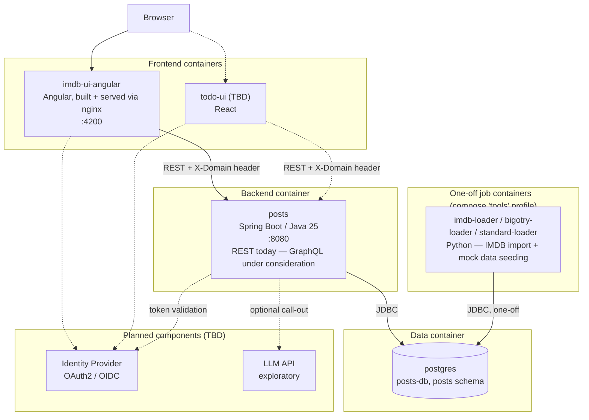
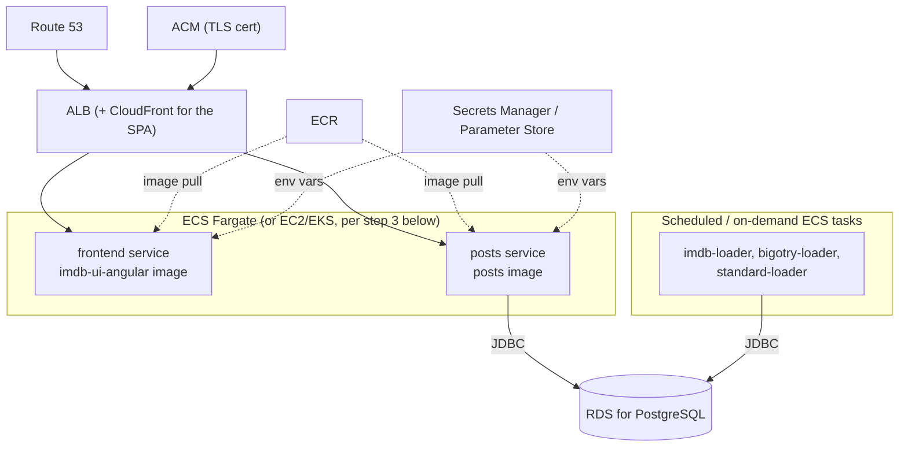

# Overall Architecture

A container-orchestration-level view of this system: what runs, how the
pieces talk to each other, and how the design stays pluggable for new
frontends, domains, and backend capabilities. For code-level detail, see
the linked component docs — this one stays at the container/service
boundary.

## Table of Contents

- [1. System Overview](#1-system-overview)
- [2. Container Topology](#2-container-topology)
- [3. Pluggable Domain Model](#3-pluggable-domain-model)
- [4. Component Documentation](#4-component-documentation)
- [5. AWS Deployment Feasibility](#5-aws-deployment-feasibility)
- [6. Planned Extensions](#6-planned-extensions)

## 1. System Overview

A Spring Boot REST API (`posts`) backed by PostgreSQL, served to one or
more Angular/React SPAs, orchestrated today with Docker Compose on a
single host.

Its defining trait: every table, service call, and endpoint is
partitioned by a **domain** concept resolved from a request header, so
unrelated frontends can share the same backend and database with no
schema change. Two domains are live today: `imdb/bigotry` and
`imdb/standard`.

- [§3](#3-pluggable-domain-model) — how the domain mechanism works
- [§5](#5-aws-deployment-feasibility) — moving today's Compose setup to AWS
- [§6](#6-planned-extensions) — what's planned next

## 2. Container Topology

Solid lines are running today; dashed lines are planned ([§6](#6-planned-extensions)).

Today's orchestration is a single `docker-compose.yml` at the repo root:

- **Services**: `postgres`, `posts`, `frontend` are long-running, started
  via `docker compose up`. `imdb-loader`, `bigotry-loader`, and
  `standard-loader` are one-off jobs under a `tools` compose profile —
  excluded from `up`, run explicitly via `docker compose run --rm <job>`.
- **Networking**: services reach each other over Compose's internal DNS
  by name (`posts` connects to `postgres:5432`, never a published host
  port). Only human/browser-facing ports (`4200`, `8080`, `postgres` at
  `5433` for direct inspection) are published, all overridable from one
  `.env` file.
- **Images**: `posts` and `imdb-ui-angular` both build as multi-stage
  images (JDK → JRE; Node → nginx), keeping the runtime image free of
  build tooling.
- **Runtime config, not build-time baking**: the backend reads its
  datasource URL and CORS origin from env vars (Spring relaxed binding).
  The frontend's backend URL is written to `/config.json` by its
  entrypoint script at container *startup*, not baked into the JS bundle.
  Either image redeploys to a new environment with no rebuild — the
  precondition for running under a different orchestrator later
  ([§5](#5-aws-deployment-feasibility), [§6](#6-planned-extensions)).

## 3. Pluggable Domain Model

Every domain-owned table carries a `domain_id`. Every request declares
its domain via an `X-Domain` header, resolved server-side up front.
Three domain-owning tables enforce this with composite foreign keys, so
a resource, post, or flag can never reference a row from a different
domain — by database constraint, not convention.

On the frontend, one `DomainConfig` object per domain drives rating
behavior, labeling, and theming, with no per-domain branching scattered
through components.

**Practical effect**: adding a domain is a Flyway migration plus, if it
needs a UI, one frontend config file — not a new service, not a schema
change. Every item in [§6](#6-planned-extensions) attaches to this seam.

Full mechanism and trade-offs: [`backend/posts/docs/architecture.md`](backend/posts/docs/architecture.md) §8,
[`frontend/imdb-ui-angular/docs/architecture.md`](frontend/imdb-ui-angular/docs/architecture.md) §4.

## 4. Component Documentation

| Component | Role | Docs |
|---|---|---|
| `backend/posts` | REST API, owns the schema (Flyway) | [`architecture.md`](backend/posts/docs/architecture.md), [`design-spec.md`](backend/posts/docs/design-spec.md) |
| `frontend/imdb-ui-angular` | SPA for the `imdb/bigotry` and `imdb/standard` domains | [`architecture.md`](frontend/imdb-ui-angular/docs/architecture.md), [`design-spec.md`](frontend/imdb-ui-angular/docs/design-spec.md), [`user-guide.md`](frontend/imdb-ui-angular/docs/user-guide.md) |
| `backend/imdb-data-python` | One-off IMDB import + mock-data seeding jobs | [`README.md`](backend/imdb-data-python/README.md), [`CLAUDE.md`](backend/imdb-data-python/CLAUDE.md) |
| Full stack / local dev | Docker Compose usage, ports, env config | [`README.md`](README.md), [`CLAUDE.md`](CLAUDE.md) |

## 5. AWS Deployment Feasibility

Largely an infrastructure change, not an application one:
[§2](#2-container-topology)'s runtime-configuration approach means none
of the three deployable images need code changes to run elsewhere — only
where their config/secrets come from, and what schedules/exposes them,
changes.

High-level migration steps, in the order they'd naturally happen:

1. **Registry** — define the stack in **AWS CDK**; its
   `DockerImageAsset` construct builds the same multi-stage Dockerfiles
   already in the repo, unchanged, and pushes to a CDK-managed ECR repo
   as part of `cdk deploy` — no separate CI step needed for a one-person
   deploy.
2. **Database** — provision RDS for PostgreSQL; point `posts` at it via
   `SPRING_DATASOURCE_URL`, the same env var Compose already sets, now
   sourced from Secrets Manager instead of `.env`.
3. **Compute** — run `posts` and `frontend` as ECS tasks (task
   definitions replace `docker-compose.yml`'s service blocks 1:1), on
   one of three mutually exclusive launch options:
   - **Fargate** — serverless; AWS runs the underlying instances, you
     never manage them. The default assumed elsewhere in this doc.
   - **EC2** (ECS's EC2 launch type, or just `docker compose up` on a
     long-lived instance) — cheaper at this app's current scale, no
     Fargate per-task premium, but you manage the instances yourself
     (patching, capacity, scaling). Worth revisiting once traffic or
     team size justifies paying for Fargate's managed overhead.
   - **EKS** — the substitute if the Kubernetes goal in
     [§6](#6-planned-extensions) is pursued instead of ECS; adds its own
     $0.10/hr control-plane fee on top of whichever of the above runs
     the actual worker nodes.
4. **Batch jobs** — run the three loaders as scheduled/on-demand ECS
   tasks (EventBridge Scheduler or manual `RunTask`), mirroring how
   Compose's `tools` profile already keeps them out of the long-running
   service set.
5. **Edge** — an ALB in front of both services (optionally CloudFront
   for the frontend), an ACM certificate, and a Route 53 record. The
   frontend's `API_BASE_URL` becomes the ALB's DNS name instead of
   `localhost:8080`, written into `/config.json` by the same entrypoint
   script at container start.
6. **Secrets/config** — move `.env`'s values (`POSTGRES_PASSWORD`,
   `SPRING_DATASOURCE_*`, `APP_CORS_ALLOWED_ORIGINS`, `API_BASE_URL`)
   into Secrets Manager / Parameter Store, injected as task-definition
   env vars — same relaxed-binding mechanism, just a different source.
7. **Deploys** — `cdk deploy` from your own machine already covers
   build, push, and stack/service update in one command, which is enough
   for a solo deploy. A GitHub Actions workflow (none exists yet, only a
   PR template is checked in) running `cdk deploy` on merge is the
   natural next step if this stops being a one-person operation.

## 6. Planned Extensions

Not yet started; listed here because they inform the shape of
[§2](#2-container-topology), [§3](#3-pluggable-domain-model), and
[§5](#5-aws-deployment-feasibility) above.

- **`todo-ui` (React)** — a to-do app: a list is a `resource`, an item is
  a `post`, status (`Waiting`/`In-Progress`/`Done`) is a `post_type`, and
  `Waiting` carries severity the same way `imdb/bigotry` does on its flag
  types. A new domain via [§3](#3-pluggable-domain-model), not a new
  service.
- **Identity Provider** — OAuth2/OIDC, replacing today's placeholder
  username-only auth (no password, no token) across every frontend.
- **LLM API** — exploratory; a candidate use case already identified is
  summarizing search results. Scope and whether it's synchronous,
  async, or a separate service are undecided.
- **GraphQL** — under consideration as an additional or alternative API
  style alongside today's REST surface.
- **Kubernetes** — a stated future orchestration target beyond today's
  single-host Docker Compose setup; not started.
