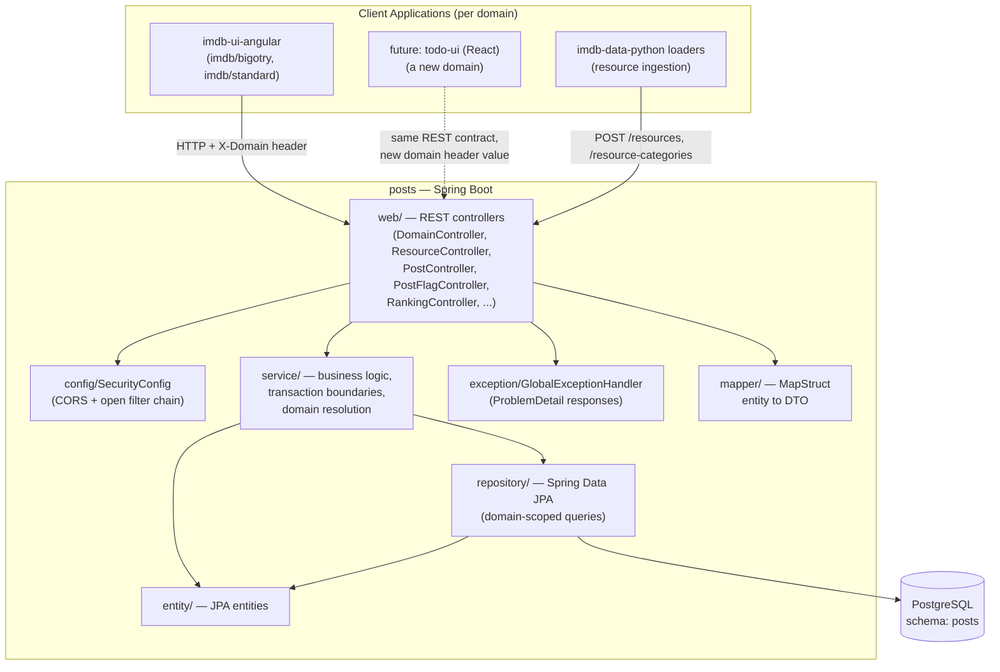
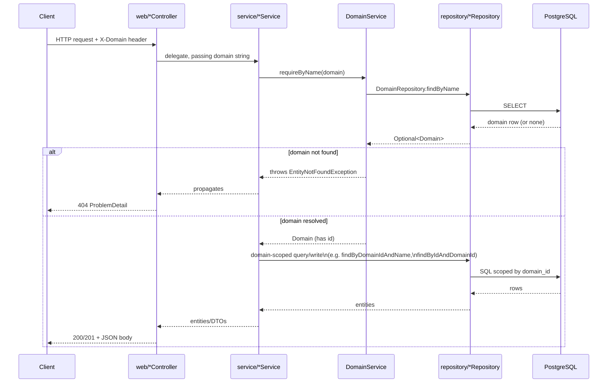
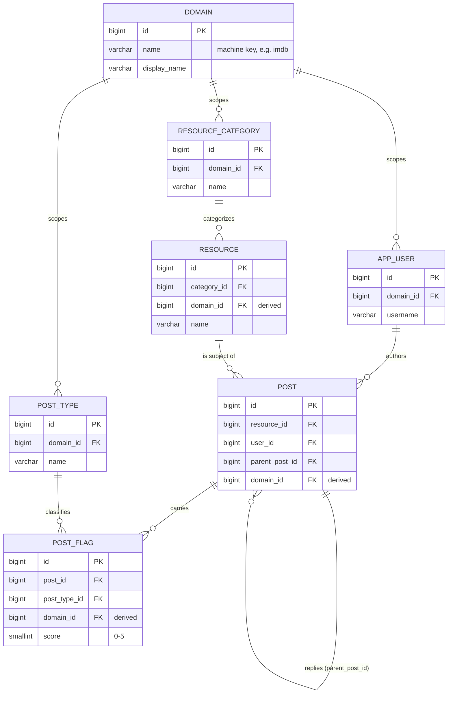

# Posts Service — Architecture

This is the current-state architecture reference for the `posts` backend:
its components, how they fit together, and — the main thing this document
exists to make explicit — how the design stays domain-agnostic so the same
schema, service layer, and REST API can serve more than one kind of
application.

This is *not* the data-model spec. For column-by-column table definitions,
constraints, and the modeling decision log, see
[`design-spec.md`](./design-spec.md) and
[`db-design-spec.md`](./db-design-spec.md). For running the service on
your machine, see [`running-locally.md`](./running-locally.md).

## Table of Contents

- [1. What This Service Is](#1-what-this-service-is)
- [2. Core Concepts (Domain-Agnostic)](#2-core-concepts-domain-agnostic)
- [3. Component Architecture](#3-component-architecture)
- [4. Request Lifecycle](#4-request-lifecycle)
- [5. REST API Surface](#5-rest-api-surface)
- [6. Package Structure](#6-package-structure)
- [7. Data Model at a Glance](#7-data-model-at-a-glance)
- [8. Multi-Domain Design](#8-multi-domain-design)
  - [8.1 How a request picks its domain](#81-how-a-request-picks-its-domain)
  - [8.2 How domain integrity is enforced](#82-how-domain-integrity-is-enforced)
  - [8.3 Adding a domain today: IMDB variants](#83-adding-a-domain-today-imdb-variants)
  - [8.4 Fitting an unrelated app: a future React to-do list](#84-fitting-an-unrelated-app-a-future-react-to-do-list)
  - [8.5 Where the model would need to grow](#85-where-the-model-would-need-to-grow)
- [9. Cross-Cutting Concerns](#9-cross-cutting-concerns)
  - [9.1 Error handling](#91-error-handling)
  - [9.2 Security & CORS](#92-security--cors)
  - [9.3 API documentation](#93-api-documentation)
  - [9.4 Auditing](#94-auditing)
  - [9.5 Observability](#95-observability)
- [10. Testing Architecture](#10-testing-architecture)
- [11. Related Documents](#11-related-documents)

## 1. What This Service Is

[↑ Back to Table of Contents](#table-of-contents)

`posts` is a Spring Boot REST API providing a generic, reusable primitive:
**threaded discussion against a catalog of resources, with optional
categorized/scored flags on individual posts** — all partitioned by a
`domain` concept that runs through every table, service method, and
endpoint.

Nothing in the entity model, service layer, or controllers is IMDB- or
bigotry-specific. Today two domains happen to be seeded — `imdb/bigotry`
(severity-scored content flags) and `imdb/standard` (a plain rating with no
severity, just counts) — but both are configuration, not code branches: the
same `Resource`/`Post`/`PostFlag` tables and the same
`PostController`/`PostFlagController` serve both. `RankingController`,
for example, is explicitly documented in its own source as domain-agnostic
— it ranks whatever `post_type` rows exist for the `X-Domain` header it's
given, with no `imdb`/`bigotry` vocabulary anywhere in it.

That same generality is why this backend is intended to eventually support
a completely unrelated frontend — a to-do list app built in React — as a
third domain, without a schema change. [§8](#8-multi-domain-design) works through what that would
look like and where the current model would need to grow to support it.

## 2. Core Concepts (Domain-Agnostic)

[↑ Back to Table of Contents](#table-of-contents)

The entity names below are deliberately generic — read them independent of
IMDB, and the multi-domain intent stays visible:

| Concept | Entity | What it represents, domain-agnostically |
|---|---|---|
| Domain | `Domain` | A named partition of everything else. Every other table either belongs directly to a domain or derives its domain from what it references. |
| Resource | `Resource` | The "thing" a thread is about. An IMDB title today; could be anything with a name, a display name, and a category. |
| Resource category | `ResourceCategory` | A domain-scoped lookup/taxonomy for resources (IMDB's `titleType` values today — `movie`, `tvSeries`, etc.). |
| Post | `Post` | A message against a resource, or a reply to another post — self-referencing via `parentPostId` for unlimited-depth threading. |
| Post type | `PostType` | A domain-scoped lookup of flag/label categories a post can carry (`racism`/`sexism`/`lgbtq-phobic`/`no-bigotry` for `imdb/bigotry`; `skip-it`/`it-was-okay`/`i-enjoyed-it`/`i-loved-it` for `imdb/standard`). |
| Post flag | `PostFlag` | A join row pairing a post with a post type and a 0–5 score. A single post can carry multiple flags, one per type. |
| User | `AppUser` | The author of a post. Scoped to exactly one domain. |

The score on `PostFlag` is the one place a domain's *semantics* leak into
an otherwise-generic column: `imdb/bigotry` uses it as a real severity
scale, while `imdb/standard` sends the same constant score on every flag
purely so it can reuse the existing schema for what's really just a rating
count — a deliberate no-schema-change choice, not an oversight (see
[`frontend/imdb-ui-angular/docs/design-spec.md`](../../../frontend/imdb-ui-angular/docs/design-spec.md)
§2 decision #7 for the
frontend-side rationale). Everything else — the table shapes, the
threading, the domain-scoping constraints — carries no assumption about
what a "resource" or a "flag" *means*.

## 3. Component Architecture

[↑ Back to Table of Contents](#table-of-contents)

Standard layered Spring MVC architecture — controllers depend on services,
services depend on repositories, nothing skips a layer:



The dashed arrow marks the not-yet-built piece: a future React client would
plug into the exact same controller layer, distinguished only by the
`X-Domain` value it sends — no new controllers or services required unless
its concept of "resource" needs fields the current model doesn't have
([§8.5](#85-where-the-model-would-need-to-grow)).

## 4. Request Lifecycle

[↑ Back to Table of Contents](#table-of-contents)

Every domain-scoped request follows the same shape, whether the caller is
`imdb-ui-angular` today or a different frontend tomorrow:



A missing `X-Domain` header never reaches this flow — Spring rejects it
with `400` before the controller method runs, since the header is a
required `@RequestHeader`. The only endpoints exempt from this entirely are
`GET /domains` and `GET /domains/{id}` (`DomainController`), since they're
how a client discovers which domain values are valid in the first place.

## 5. REST API Surface

[↑ Back to Table of Contents](#table-of-contents)

Every endpoint below except `GET /domains` and `GET /domains/{id}` requires
the `X-Domain` header ([§4](#4-request-lifecycle)). Response bodies are DTOs generated from the
entities in [§7](#7-data-model-at-a-glance), not raw entities.

| Method | Path | Purpose |
|---|---|---|
| GET | `/domains` | List all domains |
| GET | `/domains/{id}` | Get one domain |
| GET | `/resource-categories` | List categories for the current domain |
| GET | `/resource-categories/{id}` | Get one category |
| GET | `/post-types` | List post types for the current domain |
| GET | `/post-types/{id}` | Get one post type |
| POST | `/resources` | Create a resource |
| GET | `/resources` | Paginated list, optional `?categoryId=` and/or `?search=` (case-insensitive, partial match on `displayName`) filters |
| GET | `/resources/{id}` | Get one resource |
| DELETE | `/resources/{id}` | Soft-delete a resource |
| POST | `/posts` | Create a post — top-level if `parentPostId` is omitted, a reply if present; can flag it in the same call |
| POST | `/resources/{resourceId}/posts` | Create a top-level post (alternate, equivalent entry point) |
| POST | `/posts/{postId}/replies` | Create a reply (server derives the resource from the parent) |
| GET | `/resources/{resourceId}/posts` | Paginated top-level posts for a resource |
| GET | `/posts/{postId}/replies` | Paginated direct replies (one level, not the whole subtree) |
| GET | `/posts/{postId}` | Get one post |
| GET | `/users/{userId}/posts` | Paginated, all posts (top-level + replies) authored by that user, newest first |
| PATCH | `/posts/{postId}` | Edit a post's body text |
| DELETE | `/posts/{postId}` | Soft-delete a post (cascades to its reply subtree) |
| POST | `/posts/{postId}/flags` | Add/update a flag on a post (upsert by type) |
| GET | `/posts/{postId}/flags` | List active flags on a post |
| DELETE | `/posts/{postId}/flags/{flagId}` | Soft-delete a flag |
| GET | `/rankings` | Top resources per post type, for the current domain |

Ownership checks (edit/delete a post, remove a flag) run against a
client-supplied `userId`/`X-User-Id` — not yet security-enforced, since
real auth doesn't exist ([§9.2](#92-security--cors), [`design-spec.md`](./design-spec.md) §6). A temporary,
`@Profile`-gated `/dev/users` CRUD API (`AppUserController`) exists only to
create test users until real registration lands.

For request/response field shapes and curl walkthroughs against a running
instance, see [`running-locally.md`](./running-locally.md) §7, or generate
them live from the OpenAPI docs ([§9.3](#93-api-documentation)).

## 6. Package Structure

[↑ Back to Table of Contents](#table-of-contents)

Layer-based grouping, one package per architectural concern:

```
com.jp.projects.posts
├── PostsApplication
├── config/          — SecurityConfig, OpenApiConfig, JpaAuditingConfig
├── entity/          — Domain, AppUser, ResourceCategory, Resource,
│                       PostType, Post, PostFlag
├── repository/      — one Spring Data JPA repository per entity,
│                       every domain-owning lookup domain-scoped
├── service/         — DomainService, ResourceService,
│                       ResourceCategoryService, PostTypeService,
│                       PostService, PostFlagService, RankingService,
│                       AppUserService (dev-only)
├── web/             — one @RestController per aggregate
├── dto/              — request/response records, grouped by aggregate
│   ├── domain/ · post/ · postflag/ · posttype/
│   ├── resource/ · category/ · ranking/ · user/
├── mapper/          — MapStruct entity → response DTO mappers
└── exception/       — EntityNotFoundException,
                        ForbiddenOperationException,
                        GlobalExceptionHandler
```

This flat, layer-based layout (rather than package-by-feature) is a
deliberate size-appropriate choice. It would be worth revisiting if a
second domain family (e.g. a to-do app with genuinely different aggregates)
ever needed its own controllers/services rather than reusing the existing
generic ones.

## 7. Data Model at a Glance

[↑ Back to Table of Contents](#table-of-contents)

Full column definitions and the decision log behind each choice live in
[`design-spec.md`](./design-spec.md) §4 and the narrative walkthrough in
[`db-design-spec.md`](./db-design-spec.md). The shape, generically:



Schema evolution to date lives in 17 Flyway migrations
(`src/main/resources/db/migration/V1`–`V17`): the base tables (`V1`–`V6`),
retrofitting domain-scoping onto them (`V7`–`V13`), seeding `imdb/bigotry`
and its `no-bigotry` counter-flag type (`V14`, `V16`), widening
`post_flag.score` to allow an explicit-neutral `0` (`V15`), and seeding
`imdb/standard` (`V17`).

## 8. Multi-Domain Design

[↑ Back to Table of Contents](#table-of-contents)

This is the section that matters most for "can this backend support
something other than IMDB" — the short answer is yes, by construction, and
this walks through why.

### 8.1 How a request picks its domain

[↑ Back to Table of Contents](#table-of-contents)

Every domain-scoped endpoint requires an `X-Domain` request header
(`@RequestHeader("X-Domain") String domain` on every controller method
except `DomainController`'s). There's no path-based or subdomain-based
domain switch, and no per-DTO body field — a single header applies
uniformly across the entire API surface without touching every request
shape. See [§4](#4-request-lifecycle) for the resolution flow.

### 8.2 How domain integrity is enforced

[↑ Back to Table of Contents](#table-of-contents)

Three tables — `resource_category`, `post_type`, `app_user` — own a
directly client-facing `domain_id`. Three more — `resource`, `post`,
`post_flag` — carry a **derived** `domain_id`: never set independently by
a client, always resolved server-side from the row they reference, and
enforced at the database level via composite foreign keys (e.g.
`resource (category_id, domain_id) → resource_category (id, domain_id)`).
This makes it structurally impossible — not just application-logic
impossible — for a resource, post, or flag to disagree with the domain of
the row it belongs to. Full rationale and the composite-FK SQL:
[`design-spec.md`](./design-spec.md) §4.3.

### 8.3 Adding a domain today: IMDB variants

[↑ Back to Table of Contents](#table-of-contents)

Both existing domains needed **zero code changes** — each is one Flyway
migration inserting a `domain` row plus its `resource_category` and
`post_type` rows (`V14__seed_imdb_bigotry_domain.sql`,
`V17__seed_imdb_standard_domain.sql`), then resources imported via the
already-generic `imdb-loader --domain <name>`. See
`backend/posts/CLAUDE.md` "Adding a new domain" and
`backend/imdb-data-python/CLAUDE.md` for the loader side.

### 8.4 Fitting an unrelated app: a future React to-do list

[↑ Back to Table of Contents](#table-of-contents)

A `todo` domain is a good test of how far the generic model actually
stretches, since it's not just "another IMDB variant" — it has no
inherent catalog of pre-existing items the way IMDB titles do.

A plausible mapping onto the existing entities:

| To-do app concept | Maps onto |
|---|---|
| A to-do list (e.g. "Groceries") | `Resource`, with `resource_category` distinguishing list types if useful (or a single seeded category if lists aren't typed) |
| A to-do item / comment on it | `Post` — a top-level post could represent the item itself, with replies as comments/subtasks underneath it |
| Status or priority label | `PostType` + `PostFlag`, the same way `imdb/standard` already repurposes a scored flag as a plain, non-severity label — `todo`'s post types could be `not-started`/`in-progress`/`done` with a constant score, following the exact precedent `imdb/standard` already set |
| A todo-ui user | `AppUser`, domain-scoped the same as any other domain's users |

Nothing above requires a schema migration beyond the same domain-seeding
pattern [§8.3](#83-adding-a-domain-today-imdb-variants) already uses — new `domain`, `resource_category`, and
`post_type` rows. The React frontend would talk to the exact same REST
surface ([§5](#5-rest-api-surface)) with `X-Domain: todo`, and `RankingController`'s "top
resources per post type" view would, with no code change, become "which
lists have the most `done` items" instead of "which titles are most
flagged for racism" — that's the payoff of it having been built
domain-agnostic from the start ([§1](#1-what-this-service-is)).

### 8.5 Where the model would need to grow

[↑ Back to Table of Contents](#table-of-contents)

Being honest about the limits of "no schema change needed," rather than
overselling it — a to-do app (or any sufficiently different domain) would
likely eventually want things this schema doesn't have a slot for yet:

- **User-created resources, not admin/loader-seeded ones.** Today
  `POST /resources` exists but the primary path is bulk ingestion via
  `imdb-loader`. A to-do list is inherently user-created and needs to feel
  first-class, not like a workaround.
- **Resource ownership/visibility.** IMDB resources are public and shared
  across all users in a domain; a to-do list is normally private to its
  owner (or shared with a specific group). There's no ownership or
  ACL concept on `Resource` today — [`design-spec.md`](./design-spec.md) §6's real-auth gap
  would need to be resolved first, and an ownership model designed
  alongside it.
- **Structured item state beyond a label.** A checkbox's checked/unchecked
  state, a due date, a priority — these want typed fields, not a `PostFlag`
  score repurposed as a label. `Post.data jsonb` is the documented escape
  hatch for exactly this kind of per-domain extra data without a schema
  change, but a `todo` domain leaning heavily on it would be worth
  revisiting as a first-class column addition once the shape stabilizes.

None of this blocks starting a `todo` domain the way [§8.4](#84-fitting-an-unrelated-app-a-future-react-to-do-list) describes — it's
what to design next once that domain's real requirements are known, the
same confirm-before-building approach [`design-spec.md`](./design-spec.md)'s decision log
already reflects for the `imdb/*` domains.

## 9. Cross-Cutting Concerns

[↑ Back to Table of Contents](#table-of-contents)

### 9.1 Error handling

[↑ Back to Table of Contents](#table-of-contents)

`@RestControllerAdvice GlobalExceptionHandler` maps exceptions to RFC 7807
`ProblemDetail` responses uniformly across every domain and every
controller:

| Exception | Status |
|---|---|
| `EntityNotFoundException` (includes an unrecognized `X-Domain` value) | 404 |
| `ForbiddenOperationException` (ownership check failure) | 403 |
| `MethodArgumentNotValidException` (bean validation) | 400, with per-field errors |
| `DataIntegrityViolationException` (unique/FK/check violation) | 409 |
| Missing required header (e.g. `X-Domain`) | 400 (Spring default) |

### 9.2 Security & CORS

[↑ Back to Table of Contents](#table-of-contents)

`spring-boot-starter-security` is present but auth is intentionally a
placeholder — `SecurityConfig` permits every request
(`authorizeHttpRequests(auth -> auth.anyRequest().permitAll())`). What it
*does* actively configure is CORS: allowed origins come from
`app.cors.allowed-origins`, overridable via `APP_CORS_ALLOWED_ORIGINS`
(see root [`CLAUDE.md`](../../../CLAUDE.md)/README for how the Docker stack wires this to
`.env`'s `FRONTEND_PORT`). Because a future `todo-ui` React app would be
served from a different origin than `imdb-ui-angular`, its origin will
need adding to this same allow-list — one more place [§8.4](#84-fitting-an-unrelated-app-a-future-react-to-do-list)'s new domain
touches config, not code.

### 9.3 API documentation

[↑ Back to Table of Contents](#table-of-contents)

`springdoc-openapi-starter-webmvc-ui` generates OpenAPI docs from the
existing controllers/DTOs with no extra annotation burden — browsable at
`/swagger-ui.html`, raw spec at `/v3/api-docs`. Since the REST surface
itself is domain-agnostic, the generated docs describe the *shape* of
every domain's API at once; the `X-Domain` header value is what a client
chooses at call time, not something that changes the documented surface.

### 9.4 Auditing

[↑ Back to Table of Contents](#table-of-contents)

`created_at`/`updated_at` on every table are populated via Spring Data
JPA auditing (`@CreatedDate`/`@LastModifiedDate`,
`@EnableJpaAuditing` in `JpaAuditingConfig`) rather than DB defaults alone,
so the same mechanism applies uniformly regardless of domain.

### 9.5 Observability

[↑ Back to Table of Contents](#table-of-contents)

`spring-boot-starter-actuator` + `micrometer-registry-prometheus`
(`pom.xml`) instrument HTTP requests, JVM (heap/GC/threads), and the
HikariCP connection pool out of the box — no custom `MeterBinder`s needed
for any of that. Root [README.md](../../../README.md)'s "Metrics &
Monitoring" covers running it via Docker; [`observability.md`](./observability.md)
covers day-to-day usage (querying, adding metrics, editing the dashboard);
[`MONITORING-ARCHITECTURE.md`](../../../MONITORING-ARCHITECTURE.md) walks
the entire pipeline mechanically, end to end. The design decisions worth
recording here:

- **Actuator runs on its own port** (`management.server.port: 8081` in
  `application.yml`), never `server.port`. This is what lets it skip
  `SecurityConfig` entirely — Spring Boot's actuator auto-security only
  attaches when the management port is the *same* as the app's; on a
  different port, it backs off, and nothing else in this app secures that
  port either. That's deliberate, not an oversight: the port is never
  published in `docker-compose.yml`, reachable only from the `prometheus`
  container over the compose network, so network isolation is the actual
  control, not application-level auth. If this ever needs to be reachable
  from outside the compose network (a real deployment without a sidecar
  Prometheus, `deploy/kubernetes`'s stated future goal), add either a
  dedicated `SecurityFilterChain` scoped to the management context or a
  network-level restriction (security group, NetworkPolicy) before
  publishing it anywhere.
- **Not bound to `127.0.0.1`.** Loopback-only binding is the textbook
  hardening move for a management port, but it doesn't fit this compose
  topology: each service is its own network namespace, so `posts`
  binding to its own loopback would block the `prometheus` *container*
  from reaching it too, not just the outside world. It would fit a
  Kubernetes pod, where a scraper sidecar shares the pod's network
  namespace — worth revisiting once `deploy/kubernetes` is real.
- **Endpoint exposure is an explicit allow-list** (`health,info,prometheus`
  — not `*`) so a future contributor adding an actuator dependency for
  something else doesn't accidentally expose `env`, `beans`, or
  `heapdump`.
- **`http.server.requests` uses server-side histogram buckets**
  (`management.metrics.distribution.percentiles-histogram`), not
  client-computed percentiles — the former aggregate correctly across
  instances via Prometheus's `histogram_quantile()`, the latter don't.
  The provisioned Grafana dashboard's latency panels rely on this.
- **`/actuator/info` reports the actual running build** (name, version,
  build time) via the `spring-boot-maven-plugin`'s `build-info` goal
  (`pom.xml`) — cheap to keep current since it's generated at build time,
  not hand-maintained.

## 10. Testing Architecture

[↑ Back to Table of Contents](#table-of-contents)

- **Unit** (`service` layer, repositories mocked) and **`@WebMvcTest`**
  (`web` layer, services mocked) run without Docker.
- **`@DataJpaTest`** (repository layer) and **`@SpringBootTest`**
  (full integration flows) run against a real Postgres via Testcontainers
  — needed because H2 can't faithfully reproduce `jsonb`, partial unique
  indexes, or the composite FKs domain-scoping depends on ([§8.2](#82-how-domain-integrity-is-enforced)).
- None of the test infrastructure is domain-specific; integration tests
  exercise whichever domain they seed via `DomainRepository`/a
  `ClientHttpRequestInterceptor` adding the header, the same mechanism any
  future domain's tests would use.

Environment gotchas running these locally (JDK version, Testcontainers/
Docker Desktop socket issues): see [`running-locally.md`](./running-locally.md)
and the root [`CLAUDE.md`](../../../CLAUDE.md).

## 11. Related Documents

[↑ Back to Table of Contents](#table-of-contents)

| Document | Covers |
|---|---|
| [`design-spec.md`](./design-spec.md) | Canonical data model: tables, constraints, decision log |
| [`db-design-spec.md`](./db-design-spec.md) | Plain-language ERD walkthrough |
| [`running-locally.md`](./running-locally.md) | Running this service on your machine without Docker |
| [`observability.md`](./observability.md) | Using the metrics stack: dashboards, PromQL, adding your own metrics |
| [`../../../MONITORING-ARCHITECTURE.md`](../../../MONITORING-ARCHITECTURE.md) | How the Micrometer → Prometheus → Grafana pipeline works and connects, end to end |
| [`frontend/imdb-ui-angular/docs/architecture.md`](../../../frontend/imdb-ui-angular/docs/architecture.md) | How a domain's *frontend* behavior (rating mode, skin, business rules) is configured |
