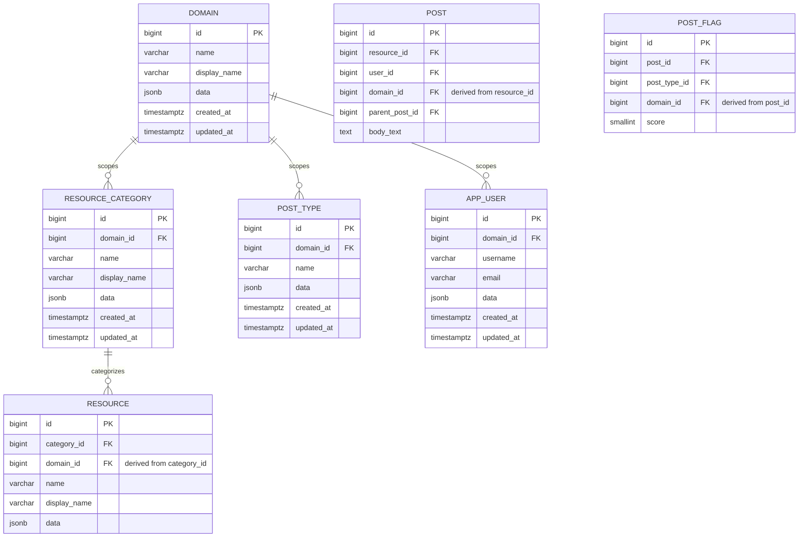

# Posts Service — Domain Scoping Spec (Proposal)

Status: **Implemented (2026-09-18).** All decisions in §2/§6 were built as
described — migrations `V7`–`V13`, entities, repositories, services,
controllers, and tests. Full implementation detail now lives in
[`implementation-spec-spring-boot.md`](./implementation-spec-spring-boot.md)
§17, and the canonical data model in [`design-spec.md`](./design-spec.md)
(decision #11, §3, §4). See [`CHANGELOG.md`](./CHANGELOG.md) for both the
decision and implementation log entries. This document is kept for its
decision rationale and is no longer updated.
Source: [`backend/TODO.txt`](../../TODO.txt)
Companion to: [`design-spec.md`](./design-spec.md) (canonical current data model —
this document proposes changes to it) and
[`implementation-spec-spring-boot.md`](./implementation-spec-spring-boot.md)
(current REST surface — this document proposes changes to it)

Unlike `design-spec.md`, this document is still evolving. It follows the
same decision-log format so it can be reviewed and edited in place; once
§6 is resolved, the content should be folded into `design-spec.md` /
`implementation-spec-spring-boot.md` and this file retired.

## Table of Contents

- [1. Motivation](#1-motivation)
- [2. Decisions (confirmed)](#2-decisions-confirmed)
- [3. Proposed Schema Changes (sketch)](#3-proposed-schema-changes-sketch)
- [4. Proposed API Changes (sketch)](#4-proposed-api-changes-sketch)
- [5. Resolved Questions](#5-resolved-questions)
- [6. Resolved Follow-Up Questions](#6-resolved-follow-up-questions)
- [7. Non-Goals](#7-non-goals)

## 1. Motivation

From `backend/TODO.txt`:

> add domain to tables. For example 'imdb', 'thought-pattern'.

Today the schema and API implicitly assume a single domain: resources are
IMDB titles, categories are IMDB `titleType` values, and posts/flags are
made against that one taxonomy. The idea is that in the future, different
frontend UIs could serve entirely different kinds of resources under the
same backend — e.g. an `imdb` domain (movies/TV) alongside a
`thought-pattern` domain (a different, unrelated resource taxonomy) — while
sharing the same tables, service layer, and REST API shape.

## 2. Decisions (confirmed)

| # | Decision | Rationale |
|---|----------|-----------|
| D1 | Introduce a `domain` **lookup table** (`id`, `name`, `display_name`, `data`, `created_at`, `updated_at`) rather than a free-text `varchar` column on each table. | Matches the existing `resource_category`/`post_type` pattern already used for controlled vocabularies — see `design-spec.md` §3. |
| D2 | `resource_category` gets a `domain_id` FK. Uniqueness becomes `UNIQUE (domain_id, name)` instead of the current global `UNIQUE (name)`. | Category values are domain-specific — `movie`/`tvSeries` are IMDB concepts; a `thought-pattern` domain needs its own, unrelated category taxonomy. |
| D3 | `post_type` gets a `domain_id` FK, same treatment as D2: `UNIQUE (domain_id, name)`. | **Confirmed domain-specific** — a `thought-pattern` domain may want a different flag taxonomy than `imdb`'s `racism`/`sexism`/`lgbtq-phobic`. |
| D4 | `app_user` gets a `domain_id` FK. Uniqueness becomes `UNIQUE (domain_id, username)` and `UNIQUE (domain_id, email)` instead of the current global uniques. | **Confirmed domain-scoped** — an account belongs to exactly one domain; the same email could exist as two separate accounts in two different domains. |
| D5 | Missing/unrecognized domain on a request is rejected via the existing `GlobalExceptionHandler` pattern (`implementation-spec-spring-boot.md` §11): a missing header → `400` (Spring's default for a required-and-absent header, no custom exception needed), an unrecognized domain value → `404` via the existing `EntityNotFoundException` handling (no new exception type needed). | Reuses infrastructure already in place rather than adding a parallel `DomainNotFoundException`. |
| D6 | Domain is communicated via a request **header**, proposed name `X-Domain`, carrying the domain's `name` (e.g. `imdb`), applied uniformly across every endpoint that touches domain-scoped data. | **Confirmed: header**, chosen over a path segment or per-DTO body field so it applies uniformly without touching every request DTO. Exact header name still open — see FQ4 in §6. |
| D7 | Seed `domain` with a single `imdb` row. `thought-pattern` is illustrative only — nothing else is seeded yet. | **Confirmed** — `imdb` is the only real domain today. |
| D8 | `resource` itself does not get an independently-settable `domain_id` — see §3 for how its per-domain uniqueness (needed per D-below) is still enforced at the DB level without one. | Keeps the "minimum" set of directly domain-owning tables to `resource_category`/`post_type`/`app_user`, per your answer to Q1. |
| D9 | `resource.name` uniqueness becomes **per-domain** rather than global. | Confirmed — two domains could plausibly mint overlapping natural keys. |
| D10 | Domain is a **data-partitioning/taxonomy concern only** for this pass — no access-control semantics. It may grow into an authorization boundary later, but that is explicitly not designed here. | Confirmed; see §7. |
| D11 | `resource.domain_id` is added as a **derived** column (client never sets it), enforced via the composite-FK mechanism in §3. | Confirmed (FQ1) — needed to make D9's per-domain uniqueness possible at all. |
| D12 | Domain consistency is enforced **all the way through the post/flag chain**: `post.domain_id` (derived from its `resource_id`) and `post_flag.domain_id` (derived from its `post_id`) are added, each the same derived/DB-enforced way as D11. `post_flag.post_type_id` must then belong to the same domain as `post_flag.domain_id`. | Confirmed (FQ2) — "enforce domain all the way through." See §3 for the trade-offs this adds, which you asked about directly. |
| D13 | `post.user_id` must belong to the same domain as the post itself: a composite FK `post (user_id, domain_id) → app_user (id, domain_id)`. | Confirmed (FQ3) — an `imdb`-domain user cannot author a post against a `thought-pattern` resource. |
| D14 | `app_user` gets an additional `UNIQUE (id, domain_id)` constraint to support D13's composite FK. **This is not a change to the primary key** — `id` alone remains the PK (and stays a single-column JPA `@Id`, unchanged from today). The extra unique constraint is trivially satisfied since `id` is already globally unique from its sequence; it exists purely so other tables can FK against the `(id, domain_id)` pair, the same way `resource_category`/`resource`/`post` do. | Answers FQ3's "composite key" question — a composite *unique constraint*, not a composite *primary key*. |
| D15 | Header name is `X-Domain`, value is the domain's `name` (e.g. `imdb`), per the proposal in D6. | Confirmed (FQ4). |

## 3. Proposed Schema Changes (sketch)

`resource_category`, `post_type`, and `app_user` each get a direct
`domain_id` FK (D2/D3/D4):



`resource`/`post`/`post_flag` each get a **derived** `domain_id` — never
set independently by the client, always resolved server-side from the row
they belong to, and enforced at the DB level with the same composite-FK
trick `design-spec.md` §4.3 already uses for `post.parent_post_id`/
`resource_id`:

```sql
-- resource: domain must match its category's domain (D11)
ALTER TABLE resource_category ADD CONSTRAINT uq_resource_category_id_domain UNIQUE (id, domain_id);
ALTER TABLE resource
    ADD CONSTRAINT fk_resource_category_same_domain
    FOREIGN KEY (category_id, domain_id) REFERENCES resource_category (id, domain_id);
ALTER TABLE resource ADD CONSTRAINT uq_resource_domain_name UNIQUE (domain_id, name);

-- post: domain must match its resource's domain, and its author's domain (D12/D13)
ALTER TABLE resource ADD CONSTRAINT uq_resource_id_domain UNIQUE (id, domain_id);
ALTER TABLE app_user ADD CONSTRAINT uq_app_user_id_domain UNIQUE (id, domain_id); -- D14

ALTER TABLE post
    ADD CONSTRAINT fk_post_resource_same_domain
    FOREIGN KEY (resource_id, domain_id) REFERENCES resource (id, domain_id);
ALTER TABLE post
    ADD CONSTRAINT fk_post_user_same_domain
    FOREIGN KEY (user_id, domain_id) REFERENCES app_user (id, domain_id);

-- post_flag: domain must match its post's domain, and the flag type's domain (D12)
ALTER TABLE post ADD CONSTRAINT uq_post_id_domain UNIQUE (id, domain_id);
ALTER TABLE post_type ADD CONSTRAINT uq_post_type_id_domain UNIQUE (id, domain_id);

ALTER TABLE post_flag
    ADD CONSTRAINT fk_post_flag_post_same_domain
    FOREIGN KEY (post_id, domain_id) REFERENCES post (id, domain_id);
ALTER TABLE post_flag
    ADD CONSTRAINT fk_post_flag_type_same_domain
    FOREIGN KEY (post_type_id, domain_id) REFERENCES post_type (id, domain_id);
```

**Trade-offs of enforcing domain end-to-end this way** (answering "do you
see any issues with this?" from FQ2):

- **Not actually new complexity, mostly.** `post` already carries a
  same-resource composite FK for `parent_post_id` today; this adds two more
  composite FKs of the same shape on the same table. Postgres has no
  problem with a table participating in several composite FKs — it's more
  constraints to declare, not a structurally different pattern.
- **One free consequence:** because a reply is already constrained to share
  its parent's `resource_id` (existing constraint), and `resource_id` now
  fixes the domain, a reply thread's domain consistency was *already*
  guaranteed transitively before this change — `post.domain_id` is mainly
  needed for D13 (the author check) and for direct per-row queries/uniques,
  not to stop a reply from drifting to a different resource's domain (that
  was already impossible).
- **Application must resolve `domain_id` itself before every insert** —
  it's not computed by a trigger or default. `PostService.createReply`/
  `createTopLevelPost` and `PostFlagService.addOrUpdateFlag`
  (`implementation-spec-spring-boot.md` §7) need an extra step to look up
  and set `domain_id` from the parent row, the same way `createReply`
  already derives `resourceId` from its parent today. Forgetting this
  fails closed (`NOT NULL`/FK violation → `409`/`400`), not silently.
- **Migration ordering matters.** Each `UNIQUE (id, domain_id)` constraint
  must exist before the child table's composite FK referencing it can be
  added, and `domain_id` must be backfilled on every existing row before
  any column can go `NOT NULL` — five migrations with a strict order
  (`resource_category` → `resource` → `app_user` → `post` → `post_flag`),
  not one.
- **Rigidity is the point, not a bug:** once in place, a resource can never
  be recategorized into a different domain's category, nor can a post's
  resource/author ever cross a domain boundary — this is the actual goal of
  "enforce domain all the way through," just worth naming explicitly since
  it's a one-way door without a data migration to undo.

## 4. Proposed API Changes (sketch)

- New read-only lookup endpoints, matching the existing
  `resource-categories`/`post-types` pattern:

  | Method | Path | Purpose |
  |---|---|---|
  | GET | `/domains` | List all domains |
  | GET | `/domains/{id}` | Get one domain |

- Every endpoint that reads or writes `resource`/`resource_category`/
  `post_type`/`app_user`/`post`/`post_flag` requires an `X-Domain` header
  (D6/D15), resolved server-side to a `domain_id` before the request is
  handled.
- Missing header → `400`; unrecognized domain value → `404` (D5).

## 5. Resolved Questions

1. **Which tables need a `domain_id`?** → `resource_category`, `post_type`,
   and `app_user`, at minimum (D2/D3/D4). `resource`'s per-domain
   uniqueness is handled without a client-settable `domain_id` — see §3
   and FQ1.
2. **Is `post_type` global or domain-specific?** → Domain-specific (D3).
3. **Are `app_user` accounts global or domain-scoped?** → Domain-scoped
   (D4) — the same email can exist as separate accounts in different
   domains.
4. **How does a request communicate its domain?** → A header (D6);
   `X-Domain` proposed but not finalized (FQ4).
5. **Does `resource.name` stay globally unique or become per-domain?** →
   Per-domain (D9).
6. **Is `imdb` the only domain to seed right now?** → Yes (D7).
7. **Is domain purely data-partitioning, or does it imply access
   control?** → Data-partitioning/taxonomy only for now; may grow into
   authorization later, but that's explicitly out of scope here (D10, §7).

## 6. Resolved Follow-Up Questions

These weren't in the original list — they were consistency questions
raised by combining the §5 answers, and are now resolved (folded into
D11–D15 above):

- **FQ1 — `resource.domain_id` mechanism.** Confirmed — D11.
- **FQ2 — Should `post_flag.post_type_id` be required to belong to the
  same domain as the post it flags?** Confirmed, "enforce domain all the
  way through" — D12. See the trade-offs analysis in §3 for the direct
  answer to "do you see any issues with this?" — short version: no
  blocking issues, mainly added migration/service-layer bookkeeping, and
  one useful realization that reply-thread domain consistency was already
  implied by the existing resource-sharing constraint.
- **FQ3 — Should a post's author belong to the same domain as the post's
  resource?** Confirmed — D13, via a composite FK against `app_user`. Your
  "composite key" question is answered by D14: it's a composite *unique
  constraint* on `app_user (id, domain_id)`, not a change to the primary
  key — `id` alone stays the PK.
- **FQ4 — Header name and value.** Confirmed — `X-Domain`, carrying the
  domain's `name` (D15).

No open items remain before this can move to implementation planning.

## 7. Non-Goals

- No per-domain authorization/access-control model in this pass (D10) —
  flagged as a plausible future direction, not designed here.
- No UI work — `backend/TODO.txt`'s Angular UI item is tracked separately.
- No code or migrations in this pass. This document is for review; nothing
  described above should be implemented until §6 is resolved and this doc
  (or its replacement content in `design-spec.md`) is confirmed.
