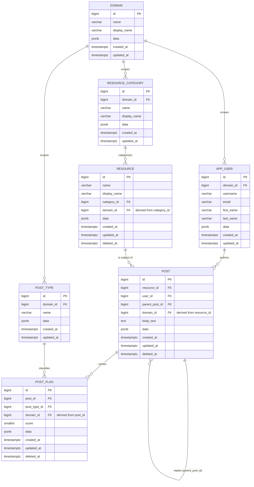

# Posts Service — Database Design Narrative

Status: Draft, pending implementation
Companion to: [`design-spec.md`](./design-spec.md) (full spec, assumptions, table
definitions, business rules)

This document walks through the entity-relationship diagram in plain
language — what each box and line actually means — for anyone who wants to
understand the schema without parsing the diagram syntax directly.

## Table of Contents

- [The Diagram](#the-diagram)
- [Reading the Notation](#reading-the-notation)
- [Walking Through Each Relationship](#walking-through-each-relationship)
- [Domain Scoping](#domain-scoping)
- [Putting It Together: One Example](#putting-it-together-one-example)

## The Diagram

## Reading the Notation

Each `||--o{` line is a one-to-many relationship. The `||` end sits on the
"one" side, the `o{` end sits on the "many" side. For example
`APP_USER ||--o{ POST : authors` reads as: **one `app_user` authors zero or
more `post` rows.** The label after the colon (`authors`, `categorizes`,
`classifies`, etc.) is just a human-readable name for the relationship — it
has no effect on the schema itself, it just makes the diagram self-explanatory.

## Walking Through Each Relationship

**`APP_USER ||--o{ POST : authors`**
A user can write many posts (top-level posts and replies alike), but every
post has exactly one author. This is the standard "author owns content"
relationship, implemented as `post.user_id` pointing back at `app_user.id`.

**`RESOURCE_CATEGORY ||--o{ RESOURCE : categorizes`**
`resource_category` is a small, fixed lookup table seeded from IMDB's own
`titleType` values (`movie`, `short`, `tvSeries`, `tvEpisode`,
`tvMiniSeries`, `tvMovie`, `tvSpecial`, `tvShort`, `video`, `videoGame` — see
`design-spec.md` §4.3 for the full list with descriptions). Each row pairs a
machine-readable `name` with a human-readable `display_name`. Every
`resource` points at exactly one category row via `resource.category_id`.
This is why a title can't belong to two categories at once in this model —
it's a single classification, not a tag list.

**`RESOURCE ||--o{ POST : "is subject of"`**
A resource (an IMDB title) can have many posts made about it, but each post
belongs to exactly one resource via `post.resource_id`. This is the anchor
that ties an entire comment thread — the top-level post and every reply
beneath it — back to the movie or show it's about.

**`POST ||--o{ POST : "replies (parent_post_id)"`**
This is the self-referencing relationship that makes threaded replies
possible. Every post has a `parent_post_id` column that points at another
row in the *same* table. A post with `parent_post_id = NULL` is a top-level
post directly on a resource. A post with `parent_post_id` set is a reply
sitting underneath that parent post. Because a post can itself be pointed at
by other posts' `parent_post_id`, replies can nest to unlimited depth — a
reply to a reply to a reply, and so on — which is how the "one user posts,
others reply underneath" requirement is satisfied. A recommended composite
foreign key (`post(id, resource_id)` → `post(parent_post_id, resource_id)`,
detailed in `design-spec.md` §4.3) additionally guarantees that a reply
always shares its `resource_id` with its parent, so a thread can never
accidentally jump to a different movie or show.

`post` (along with `resource` and `post_flag`) also carries a nullable
`deleted_at` column for soft delete — rows are never hard-deleted, only
marked. Because the self-reference forms a tree, deleting a post has a
cascading effect on that tree: removing a post hides its *entire* reply
subtree, not just the one row. The recommended approach is to set
`deleted_at` on the post and every descendant beneath it at delete time,
rather than recomputing "is any ancestor deleted" on every read.

**`POST ||--o{ POST_FLAG : carries`**
A single post can carry multiple flags — for example, one post could be
flagged as both racist and sexist in the same submission. Each of those
flags is its own row in `post_flag`, linked back to the post via
`post_flag.post_id`. This is why type/score isn't stored directly on `post`
itself: a post needs to support zero, one, or several flags simultaneously.

**`POST_TYPE ||--o{ POST_FLAG : classifies`**
`post_type` is the second small lookup table, holding the fixed set of flag
categories (`racism`, `sexism`, `lgbtq-phobic`). Each `post_flag` row points
at exactly one `post_type` via `post_flag.post_type_id`, and additionally
carries its own `score` (0–5, where 0 is neutral and 5 is most severe). So
a single post having both a racism flag scored 4 and a sexism flag scored 2
would be two separate `post_flag` rows, both pointing at the same
`post.id`, each pointing at a different `post_type.id`.

## Domain Scoping

**`DOMAIN ||--o{ RESOURCE_CATEGORY : scopes`** (and the same relationship to
`POST_TYPE` and `APP_USER`)
`domain` is a new lookup table — today it holds a single row, `imdb` — that
partitions the rest of the schema so unrelated resource taxonomies could
eventually share this same database. `resource_category`, `post_type`, and
`app_user` each point at exactly one `domain` row directly. `resource`,
`post`, and `post_flag` don't get to pick their own `domain_id` — it's
*derived*: a `resource`'s domain must match its `category`'s domain, a
`post`'s domain must match both its `resource`'s domain and its author's
domain, and a `post_flag`'s domain must match both its `post`'s domain and
its `post_type`'s domain. Each of these is enforced with a composite
foreign key against an `(id, domain_id)` pair on the parent table — the
same technique the `parent_post_id`/`resource_id` same-thread constraint
above already uses, just one column wider. The practical effect: it's
impossible at the database level for a post to reference a resource from a
different domain, or to be flagged with a type that belongs to some other
domain. Full rationale and the trade-offs of enforcing this end-to-end:
[`domain-scoping-spec.md`](./domain-scoping-spec.md).

## Putting It Together: One Example

Imagine a top-level post on the resource "The Room" that gets a reply, and
the reply is flagged twice:

- `resource` row: `The Room` (category → `movie`, domain → `imdb`)
- `post` row #1: `resource_id` → The Room, `parent_post_id` → NULL (top-level)
- `post` row #2: `resource_id` → The Room, `parent_post_id` → 1 (a reply to post #1)
- `post_flag` row A: `post_id` → 2, `post_type_id` → `racism`, `score` → 4
- `post_flag` row B: `post_id` → 2, `post_type_id` → `sexism`, `score` → 2

Post #2 shows up nested underneath post #1 in the thread, and carries two
independent severity flags — exactly the shape the diagram describes. Every
row here — the resource, both posts, and both flags — carries the same
`domain_id` as "The Room", inherited transitively down the chain.
