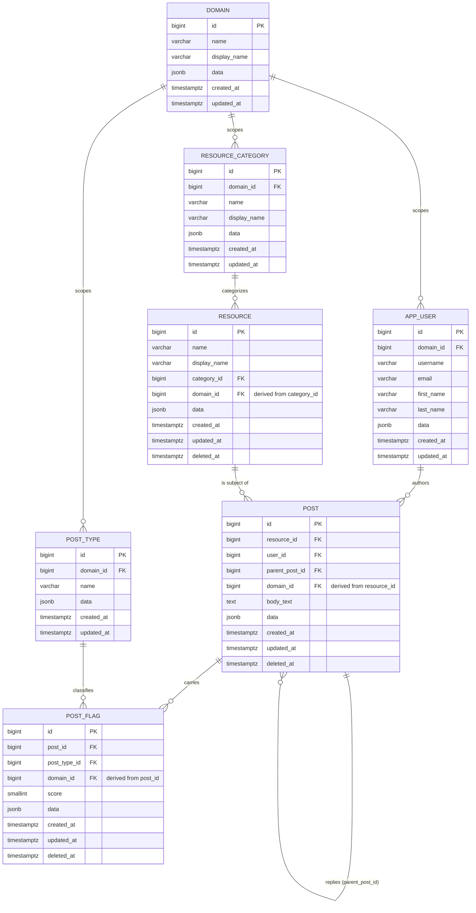

# Posts Service — Design Spec

Status: Implemented. Canonical data model reference — kept up to date as
the schema evolves, rather than a point-in-time plan.
This document specifies the **domain-agnostic** schema: tables, columns,
constraints, and the rules that hold regardless of which domain is using
them. It deliberately avoids describing what a given domain's categories,
flag types, or resources actually *are* — that's seed data, not schema, and
lives in the Flyway migrations that seed each domain (see [§4.3](#43-table-definitions)'s pointers).
For a narrative ERD walkthrough, see
[`db-design-spec.md`](./db-design-spec.md). For how this generality is
meant to serve more than the current IMDB domains, see
[`architecture.md`](./architecture.md) §8.

## Table of Contents

- [1. Overview](#1-overview)
- [2. Decision Log](#2-decision-log)
- [3. Entity Overview](#3-entity-overview)
- [4. Data Model](#4-data-model)
  - [4.1 Mermaid ER Diagram](#41-mermaid-er-diagram)
  - [4.2 Example Thread Shape](#42-example-thread-shape)
  - [4.3 Table Definitions](#43-table-definitions)
- [5. Business Rules Summary](#5-business-rules-summary)
- [6. Open Questions](#6-open-questions-not-yet-answered--do-not-build-against-these)
- [7. Tech Stack](#7-tech-stack)

## 1. Overview

[↑ Back to Table of Contents](#table-of-contents)

Users can create posts against a **resource** — a catalog item scoped to a
**domain** (a partition that lets unrelated resource taxonomies share this
same schema; see [§2](#2-decision-log) decision #11). Other users can reply underneath any
post, forming an unbounded comment thread per resource. A post can be
flagged with one or more **post types** (a domain-defined taxonomy — e.g.
content-warning categories, or a plain rating scale), each flag carrying
its own 0–5 score (0 = neutral, 5 = most severe/highest, meaning defined
per domain).

Today's seeded domains are both IMDB-catalog variants
(`imdb/bigotry`, `imdb/standard` — see the domain's own seed migration for
its specific categories/types), but nothing in this schema assumes that.

## 2. Decision Log

[↑ Back to Table of Contents](#table-of-contents)

Confirmed decisions resolving gaps/ambiguities in the original
`requirements.txt`:

| # | Decision | Rationale |
|---|----------|-----------|
| 1 | `post` and `users_posts` are **collapsed into a single `post` table**, self-referencing via `parent_post_id` for threading. | The original draft had two overlapping tables. |
| 2 | `resource_category` is a **domain-scoped lookup/enum table**; `resource` holds a single `category_id` FK. | One category per resource, not a many-to-many tag. |
| 3 | Reply nesting is **unlimited depth** via `parent_post_id`. | True threaded comments. |
| 4 | A post can carry **multiple type flags**, each with its own score, via join table `post_flag(post_id, post_type_id, score)`. | A single post can be flagged under several types at once, each with a different severity. |
| 5 | `post` and `post_flag` get **soft delete** (`deleted_at timestamptz`, nullable). | No hard deletes of user-generated content; users can edit/delete their own posts/flags. |
| 6 | `post_flag`'s uniqueness is a **partial unique index**: `UNIQUE (post_id, post_type_id) WHERE deleted_at IS NULL`. | Soft-deleting a flag shouldn't permanently block re-adding the same type later. |
| 7 | `resource` rows are populated primarily by an external batch/ingestion process, with `POST /resources` also available for direct creation. | Bulk catalog data needs a bulk path; direct creation stays available. |
| 8 | `resource`'s API surface is **Create, Read, Delete — no Update**. | Scope decision for the current phase. |
| 9 | `resource` also gets `deleted_at` (soft delete). | `post.resource_id` is a hard FK — hard-deleting a resource with posts against it would either violate the FK or cascade-destroy those posts. |
| 10 | Soft-deleting a `post` **cascades to its entire reply subtree**. | All descendant replies are hidden along with the deleted post, not just the post itself. |
| 11 | Every table is scoped to a **domain** lookup table, so the schema can serve unrelated resource taxonomies side by side. `resource_category`/`post_type`/`app_user` own a `domain_id`; `resource`/`post`/`post_flag` get a *derived* `domain_id`, DB-enforced via composite FKs rather than client-set. | Lets unrelated domains (e.g. a future non-IMDB app) share this schema without cross-contaminating each other's data; see migrations `V7`–`V13`. |
| 12 | `post_flag.score` range is **0–5** (not 1–5). `0` is an explicit "neutral" data point, distinct from having no `post_flag` row at all for that type. | `V15__widen_post_flag_score_range.sql`. Aggregates (e.g. `/rankings`) naturally pull toward 0 when neutral flags are included — intended. |

Additional engineering defaults, applied for consistency rather than
requested explicitly (revisit if unwanted):

- **`user` → `app_user`**: `user` is a Postgres reserved word.
- **Audit columns**: `created_at`/`updated_at` on every table.
- **`data jsonb`** on every table, for domain-specific extra fields without
  a schema change.
- **Reply scoping**: a reply always inherits its parent post's
  `resource_id` — it doesn't pick a new one. DB-enforced via composite FK
  ([§4.3](#43-table-definitions)).
- **`resource.name`**: treated as a natural/external key from whatever
  system originates a domain's resources (e.g. IMDB's `tconst` for the
  `imdb/*` domains today), with `display_name` as the human-readable label.
  Validation against that external source is an open question ([§6](#6-open-questions-not-yet-answered--do-not-build-against-these)).

## 3. Entity Overview

[↑ Back to Table of Contents](#table-of-contents)

- **domain** — lookup table partitioning all other data (decision #11).
- **app_user** — a registered user; author of posts. Scoped to a domain.
- **resource_category** — domain-scoped lookup table for a resource's
  taxonomy (e.g. IMDB title types for the `imdb/*` domains). Seed values
  live in each domain's own migration, not in this spec.
- **resource** — the catalog item posts are made against. Domain derived
  from its category.
- **post_type** — domain-scoped lookup of flag/label categories a post can
  carry. Seed values live in each domain's own migration.
- **post** — a user's post against a resource, or a reply to another post
  (self-referencing thread). Domain derived from its resource; author must
  belong to the same domain.
- **post_flag** — join table attaching one or more `post_type` + score
  (0–5) to a `post`. Domain derived from its post; flag type must belong
  to the same domain.

## 4. Data Model

[↑ Back to Table of Contents](#table-of-contents)

### 4.1 Mermaid ER Diagram

[↑ Back to Table of Contents](#table-of-contents)



`resource`, `post`, and `post_flag`'s `domain_id` is never set
independently by a client — it's derived and DB-enforced via composite FKs
(e.g. `resource (category_id, domain_id) → resource_category (id,
domain_id)`), so it can never disagree with the row it's derived from —
the same composite-FK SQL is repeated inline with each table below ([§4.3](#43-table-definitions)).

### 4.2 Example Thread Shape

[↑ Back to Table of Contents](#table-of-contents)

Illustrates how `parent_post_id` produces unlimited nesting for a single
resource, independent of what that resource represents:

```mermaid
flowchart TD
    R["Resource #42"]
    P1["post #1 (top-level)\nuser: alice\nparent_post_id: null"]
    P2["post #2 (reply to #1)\nuser: bob\nparent_post_id: 1"]
    P3["post #3 (reply to #2)\nuser: carol\nparent_post_id: 2"]
    P4["post #4 (reply to #1)\nuser: dave\nparent_post_id: 1"]

    R --> P1
    P1 --> P2
    P2 --> P3
    P1 --> P4
```



### 4.3 Table Definitions

[↑ Back to Table of Contents](#table-of-contents)

**domain**

| Column | Type | Constraints |
|---|---|---|
| id | bigint | PK |
| name | varchar | NOT NULL, UNIQUE — machine key, e.g. `imdb/bigotry` |
| display_name | varchar | NOT NULL |
| data | jsonb | |
| created_at | timestamptz | NOT NULL, default now() |
| updated_at | timestamptz | NOT NULL, default now() |

Current seed values: `V7`, `V14`, `V17` (`imdb/bigotry`, `imdb/standard`).

**app_user**

| Column | Type | Constraints |
|---|---|---|
| id | bigint | PK |
| domain_id | bigint | NOT NULL, FK → domain.id |
| username | varchar | NOT NULL, UNIQUE per domain (`UNIQUE (domain_id, username)`) |
| email | varchar | NOT NULL, UNIQUE per domain (`UNIQUE (domain_id, email)`) |
| first_name | varchar | |
| last_name | varchar | |
| data | jsonb | |
| created_at | timestamptz | NOT NULL, default now() |
| updated_at | timestamptz | NOT NULL, default now() |

Also carries `UNIQUE (id, domain_id)` so `post` can FK against the pair
(see **post** below) — not a change to the primary key, which stays `id`
alone.

**resource_category**

| Column | Type | Constraints |
|---|---|---|
| id | bigint | PK |
| domain_id | bigint | NOT NULL, FK → domain.id. Also carries `UNIQUE (id, domain_id)` so `resource` can FK against the pair. |
| name | varchar | NOT NULL, UNIQUE per domain (`UNIQUE (domain_id, name)`) — machine key |
| display_name | varchar | NOT NULL — human-readable label |
| data | jsonb | |
| created_at | timestamptz | NOT NULL, default now() |
| updated_at | timestamptz | NOT NULL, default now() |

Seed values are domain-specific and loaded by migration, not specified
here — e.g. `V2__seed_lookup_tables.sql` for the original IMDB `titleType`
taxonomy the `imdb/*` domains share.

**resource**

| Column | Type | Constraints |
|---|---|---|
| id | bigint | PK |
| domain_id | bigint | NOT NULL. **Derived from `category_id`**, never set independently — see the composite FK below. Also carries `UNIQUE (id, domain_id)` so `post` can FK against the pair. |
| name | varchar | NOT NULL, UNIQUE per domain (`UNIQUE (domain_id, name)`; external/natural key) |
| display_name | varchar | NOT NULL |
| category_id | bigint | NOT NULL, FK → resource_category.id |
| data | jsonb | |
| created_at | timestamptz | NOT NULL, default now() |
| updated_at | timestamptz | NOT NULL, default now() |
| deleted_at | timestamptz | NULLABLE — soft delete marker; NULL = active. Required so deleting a resource can't orphan or cascade-destroy posts made against it. |

```sql
ALTER TABLE resource
    ADD CONSTRAINT fk_resource_category_same_domain
    FOREIGN KEY (category_id, domain_id) REFERENCES resource_category (id, domain_id);
```

**post_type**

| Column | Type | Constraints |
|---|---|---|
| id | bigint | PK |
| domain_id | bigint | NOT NULL, FK → domain.id. Also carries `UNIQUE (id, domain_id)` so `post_flag` can FK against the pair. |
| name | varchar | NOT NULL, UNIQUE per domain (`UNIQUE (domain_id, name)`) |
| data | jsonb | |
| created_at | timestamptz | NOT NULL, default now() |
| updated_at | timestamptz | NOT NULL, default now() |

Seed values are domain-specific — e.g. `V14`/`V16` seed `imdb/bigotry`'s
severity-flag types, `V17` seeds `imdb/standard`'s plain rating types.

**post**

| Column | Type | Constraints |
|---|---|---|
| id | bigint | PK |
| domain_id | bigint | NOT NULL. **Derived from `resource_id`**, never set independently — see the composite FKs below. Also carries `UNIQUE (id, domain_id)` so `post_flag` can FK against the pair. |
| resource_id | bigint | NOT NULL, FK → resource.id |
| user_id | bigint | NOT NULL, FK → app_user.id (author) |
| parent_post_id | bigint | NULLABLE, FK → post.id (NULL = top-level post) |
| body_text | text | NOT NULL |
| data | jsonb | |
| created_at | timestamptz | NOT NULL, default now() |
| updated_at | timestamptz | NOT NULL, default now() |
| deleted_at | timestamptz | NULLABLE — soft delete marker; NULL = active. Set when the author deletes their own post. |

A reply must belong to the same resource as its parent, and a post's
domain must match both its resource's and its author's domain — all
DB-enforced via composite FKs:

```sql
ALTER TABLE post ADD CONSTRAINT uq_post_id_resource UNIQUE (id, resource_id);
ALTER TABLE post ADD CONSTRAINT fk_post_parent_same_resource
    FOREIGN KEY (parent_post_id, resource_id) REFERENCES post (id, resource_id);

ALTER TABLE post
    ADD CONSTRAINT fk_post_resource_same_domain
    FOREIGN KEY (resource_id, domain_id) REFERENCES resource (id, domain_id);
ALTER TABLE post
    ADD CONSTRAINT fk_post_user_same_domain
    FOREIGN KEY (user_id, domain_id) REFERENCES app_user (id, domain_id);
```

**post_flag**

| Column | Type | Constraints |
|---|---|---|
| id | bigint | PK |
| domain_id | bigint | NOT NULL. **Derived from `post_id`**, never set independently — see the composite FKs below. |
| post_id | bigint | NOT NULL, FK → post.id |
| post_type_id | bigint | NOT NULL, FK → post_type.id |
| score | smallint | NOT NULL, CHECK (score BETWEEN 0 AND 5) — 0 = neutral (decision #12) |
| data | jsonb | |
| created_at | timestamptz | NOT NULL, default now() |
| updated_at | timestamptz | NOT NULL, default now() |
| deleted_at | timestamptz | NULLABLE — soft delete marker; NULL = active. Set when the author removes that flag from their post. |

A flag's domain must match both its post's domain and its flag type's
domain, and only one active flag per `(post_id, post_type_id)` is allowed
(a partial index so re-adding a soft-deleted type doesn't stay blocked):

```sql
ALTER TABLE post_flag
    ADD CONSTRAINT fk_post_flag_post_same_domain
    FOREIGN KEY (post_id, domain_id) REFERENCES post (id, domain_id);
ALTER TABLE post_flag
    ADD CONSTRAINT fk_post_flag_type_same_domain
    FOREIGN KEY (post_type_id, domain_id) REFERENCES post_type (id, domain_id);

CREATE UNIQUE INDEX uq_post_flag_active_post_type
    ON post_flag (post_id, post_type_id)
    WHERE deleted_at IS NULL;
```

Re-flagging the same type on an already-active flag updates the existing
row's score rather than inserting a duplicate.

## 5. Business Rules Summary

[↑ Back to Table of Contents](#table-of-contents)

1. A post always belongs to exactly one resource (directly, or via its
   thread's root post).
2. `parent_post_id = NULL` marks a top-level post; non-null marks a reply,
   nested to unlimited depth.
3. A post can carry zero or more `post_flag` entries, each pairing a
   `post_type` with a 0–5 score (0 = neutral).
4. A resource has exactly one category.
5. Users can edit their own `post` in place (silently overwriting
   `body_text`, no edit history) and soft-delete their own `post` or
   individual `post_flag` entries. Soft-deleted rows are never hard-deleted.
6. Soft-deleting a `post` cascades to its entire reply subtree, not just
   the post itself.
7. Every request to a domain-scoped endpoint carries an `X-Domain` header;
   a missing or unrecognized domain is rejected rather than defaulted. A
   resource/post/flag can never cross a domain boundary from the
   category/resource/post it's derived from (decision #11).

## 6. Open Questions (not yet answered — do not build against these)

[↑ Back to Table of Contents](#table-of-contents)

- **`POST /resources` validation**: should submitted resources be
  validated against the domain's external source dataset (e.g. IMDB's
  `title.basics.tsv` for the `imdb/*` domains), or can a resource be
  created arbitrarily with any `name`/`category`? Currently unvalidated
  ([§2](#2-decision-log) additional-defaults note on `resource.name`).
- **Cascading soft delete**: currently implemented as a write-time
  recursive cascade (decision #10) — is that the right trade-off long
  term, or should "hidden because an ancestor is deleted" instead be
  computed at read time (keeping each row's `deleted_at` meaning "the user
  deleted *this* row specifically")?
- **Auth/authz**: deferred. No schema impact assumed yet — if
  roles/permissions are needed later (e.g. moderator vs. regular user),
  that likely means an `app_user.role` column or a separate roles table,
  to be designed when this is tackled.
- **Moderation workflow**: deferred, TBD.

## 7. Tech Stack

[↑ Back to Table of Contents](#table-of-contents)

Spring Boot (Spring REST + Spring Data JPA), PostgreSQL. Implementation
detail: [`architecture.md`](./architecture.md).
