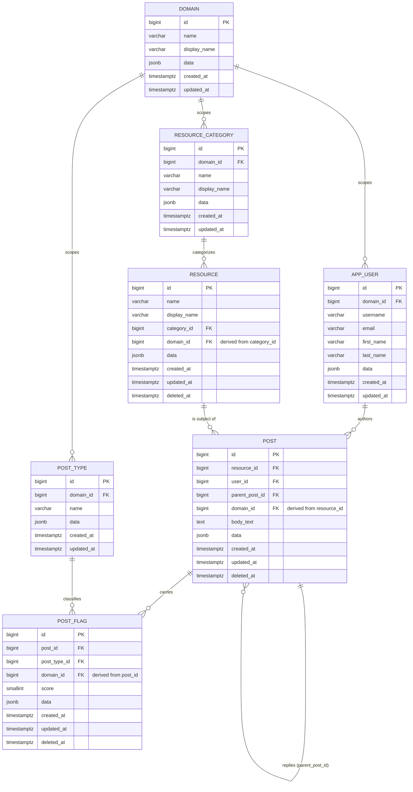
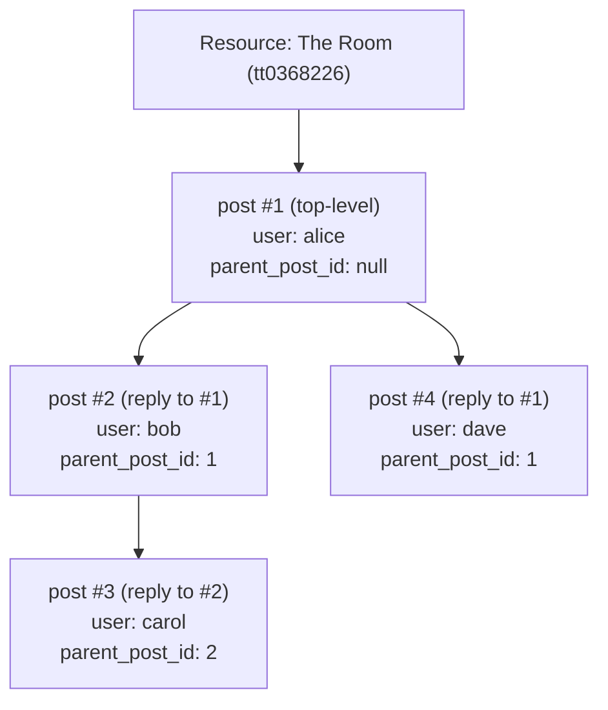

# Posts Service — Design Spec (v0.1)

Status: Draft, pending implementation
Source: [`docs/requirements.txt`](./requirements.txt)

## Table of Contents

- [1. Overview](#1-overview)
- [2. Assumptions & Decisions](#2-assumptions--decisions)
- [3. Entity Overview](#3-entity-overview)
- [4. Data Model](#4-data-model)
  - [4.1 Mermaid ER Diagram](#41-mermaid-er-diagram)
  - [4.2 Example Thread Shape](#42-example-thread-shape)
  - [4.3 Table Definitions](#43-table-definitions)
- [5. Business Rules Summary](#5-business-rules-summary)
- [6. Resolved Questions](#6-resolved-questions)
- [7. Open Questions (not yet answered — do not build against these)](#7-open-questions-not-yet-answered--do-not-build-against-these)
- [8. Tech Stack](#8-tech-stack)

## 1. Overview

Users can create posts against a **resource** (an IMDB catalog title — movie,
TV entry, video, or video game). Other
users can reply underneath any post, forming an unbounded comment thread per
resource. Each post can be flagged with one or more **post types**
(`racism`, `sexism`, `lgbtq-phobic`), and each flag carries its own
0–5 severity score (0 = neutral, 5 = most severe).

## 2. Assumptions & Decisions

These resolve gaps/ambiguities in the original `requirements.txt` and were
confirmed with the requester:

| # | Decision | Rationale |
|---|----------|-----------|
| 1 | `post` and `users_posts` are **collapsed into a single `post` table**, self-referencing via `parent_post_id` for threading. | The original draft had two overlapping tables; requester chose to merge them. |
| 2 | `resource_category` is a **lookup/enum table** seeded from IMDB's `titleType` values (see §4.3). `resource` holds a single `category_id` FK. | Confirmed: one category per resource, not a many-to-many tag. |
| 3 | Reply nesting is **unlimited depth** (true threaded comments) via `parent_post_id`. | Confirmed. |
| 4 | A post can carry **multiple type flags**, each with its own score, via a new join table `post_flag(post_id, post_type_id, score)`. | Confirmed: a single post can be flagged as e.g. both racism and sexism with different severities. |
| 5 | `post` and `post_flag` get **soft delete** via a nullable `deleted_at timestamptz` column — no hard deletes of user-generated content. | Confirmed: users can edit or delete their own posts/flags. |
| 6 | `post_flag`'s uniqueness constraint becomes a **partial unique index**: `UNIQUE (post_id, post_type_id) WHERE deleted_at IS NULL`. | Needed so soft-deleting a flag doesn't permanently block re-adding the same type later. |
| 7 | `resource` rows are primarily populated by an external batch/ingestion process (separate project, Spring Batch is a candidate) against IMDB data, but a `POST /resources` REST endpoint will also exist to add a resource directly. | Confirmed. |
| 8 | The `resource` API surface is **Create, Read, Delete (no Update)** for now. | Confirmed. |
| 9 | `resource` also gets a nullable `deleted_at` (soft delete), same pattern as `post`/`post_flag`. | Not explicitly asked, but required once resource supports Delete: `post.resource_id` is a hard FK, so hard-deleting a resource that still has posts against it would either violate the FK or cascade-destroy those posts. Soft delete avoids both. Flagging here — revisit if a different approach is preferred. |
| 10 | Soft-deleting a `post` **cascades to its entire reply subtree** — all descendant replies are hidden along with it, not just the deleted post itself. | Confirmed. |
| 11 | Every table is scoped to a **domain** (a new lookup table, seeded with `imdb`) so the schema can eventually serve unrelated resource taxonomies side by side. `resource_category`, `post_type`, and `app_user` each own a `domain_id`; `resource`, `post`, and `post_flag` get a *derived* `domain_id` enforced via composite FKs rather than set independently. Full rationale, decision log, and Flyway migration list: [`domain-scoping-spec.md`](./domain-scoping-spec.md) and [`CHANGELOG.md`](./CHANGELOG.md). | Confirmed and implemented — see §4.3 for the resulting table shapes. |
| 12 | `post_flag.score` range widened from **1–5 to 0–5**. `0` is an explicit "neutral" data point — the flagger looked at this post for that category and found it a non-issue — distinct from simply not having a `post_flag` row for that type at all. | Confirmed and implemented (`V15__widen_post_flag_score_range.sql`). Averages in the `/rankings` endpoint (§3.5 of `implementation-spec-spring-boot.md`) naturally pull toward 0 when neutral flags are included, which is the intended effect. |

Additional engineering defaults applied for consistency (flagged here rather
than silently assumed — revisit if unwanted):

- **Table naming**: `user` is renamed to `app_user` because `user` is a
  reserved word in Postgres. All other table names are unchanged.
- **Audit columns**: `created_at`/`updated_at` are added to *every* table for
  consistency, even though the original draft only listed them on `user` and
  `resource`.
- **JSON column**: every table keeps a `data jsonb` column, per the
  "dump extra data in there" requirement.
- **Reply scoping**: a reply always belongs to the same `resource_id` as its
  parent post (it inherits the thread's resource — it doesn't pick a new
  one). Enforced at the DB level via a composite FK (see §4.3).
- **`resource.name`**: assumed to be a natural/external key (e.g. the IMDB
  `tconst` id, matching `imdb-data/title.basics.tsv`), with `display_name`
  as the human-readable title. Not yet confirmed with IMDB ingestion —
  flagging as an open question in §6.

## 3. Entity Overview

- **domain** — lookup table partitioning all other data (e.g. `imdb`;
  see decision #11 and [`domain-scoping-spec.md`](./domain-scoping-spec.md)).
- **app_user** — a registered user; author of posts. Scoped to a domain.
- **resource_category** — lookup table of IMDB title types (`movie`, `short`,
  `tvSeries`, `tvEpisode`, `tvMiniSeries`, `tvMovie`, `tvSpecial`, `tvShort`,
  `video`, `videoGame` — full list with descriptions in §4.3). Scoped to a
  domain.
- **resource** — an IMDB catalog title (see `resource_category` for its
  specific type) that posts can be made against. Domain derived from its
  category.
- **post_type** — lookup values for flag type: `racism`, `sexism`, `lgbtq-phobic`.
  Scoped to a domain.
- **post** — a user's post against a resource, or a reply to another post
  (self-referencing thread). Domain derived from its resource; author must
  belong to the same domain.
- **post_flag** — join table attaching one or more `post_type` + severity
  `score` (0–5, 0 = neutral) to a `post`. Domain derived from its post;
  flag type must belong to the same domain.

## 4. Data Model

### 4.1 Mermaid ER Diagram



`resource`, `post`, and `post_flag`'s `domain_id` is never set
independently by a client — it's derived and DB-enforced via composite FKs
(e.g. `resource (category_id, domain_id) → resource_category (id,
domain_id)`), so it can never disagree with the row it's derived from. Full
rationale: [`domain-scoping-spec.md`](./domain-scoping-spec.md) §3.

### 4.2 Example Thread Shape

Illustrates how `parent_post_id` produces unlimited nesting for a single
resource:



### 4.3 Table Definitions

**domain**

| Column | Type | Constraints |
|---|---|---|
| id | bigint | PK |
| name | varchar | NOT NULL, UNIQUE — machine key, e.g. `imdb` |
| display_name | varchar | NOT NULL |
| data | jsonb | |
| created_at | timestamptz | NOT NULL, default now() |
| updated_at | timestamptz | NOT NULL, default now() |

Seeded with a single `imdb` row today (decision #11,
[`domain-scoping-spec.md`](./domain-scoping-spec.md)).

**app_user**

| Column | Type | Constraints |
|---|---|---|
| id | bigint | PK |
| domain_id | bigint | NOT NULL, FK → domain.id |
| username | varchar | NOT NULL, UNIQUE per domain (`UNIQUE (domain_id, username)`) |
| email | varchar | NOT NULL, UNIQUE per domain (`UNIQUE (domain_id, email)`) |
| first_name | varchar | |
| last_name | varchar | |
| data | jsonb | |
| created_at | timestamptz | NOT NULL, default now() |
| updated_at | timestamptz | NOT NULL, default now() |

Also carries `UNIQUE (id, domain_id)` so `post` can FK against the pair
(see **post** below) — not a change to the primary key, which stays `id`
alone.

**resource_category**

| Column | Type | Constraints |
|---|---|---|
| id | bigint | PK |
| domain_id | bigint | NOT NULL, FK → domain.id. Also carries `UNIQUE (id, domain_id)` so `resource` can FK against the pair. |
| name | varchar | NOT NULL, UNIQUE per domain (`UNIQUE (domain_id, name)`) — machine key, matches IMDB `titleType` (see seed data below) |
| display_name | varchar | NOT NULL — human-readable label |
| data | jsonb | |
| created_at | timestamptz | NOT NULL, default now() |
| updated_at | timestamptz | NOT NULL, default now() |

Seed data (loaded by a separate seed/ingestion process, not created at
runtime by the application — `display_name` values below are suggested and
can be adjusted in that seed script without a schema change):

| name | display_name | Description |
|---|---|---|
| `movie` | Movie | A standard feature film or theatrical release. |
| `short` | Short Film | A short film with a brief runtime. |
| `tvSeries` | TV Series | An ongoing or completed television series. |
| `tvEpisode` | TV Episode | An individual episode belonging to a television series. |
| `tvMiniSeries` | TV Mini-Series | A limited television series with a predetermined number of episodes. |
| `tvMovie` | TV Movie | A film made specifically for television broadcast. |
| `tvSpecial` | TV Special | A special television broadcast (such as a holiday or one-off event special). |
| `tvShort` | TV Short | A short-form program made for television. |
| `video` | Video | Direct-to-video releases or music videos. |
| `videoGame` | Video Game | Interactive video game titles cataloged on IMDb. |

These names line up with IMDB's own `titleType` field in
`imdb-data/title.basics.tsv`, which further supports the open assumption in
§2 that `resource.name` is sourced directly from that dataset (still
unconfirmed — see §6).

**resource**

| Column | Type | Constraints |
|---|---|---|
| id | bigint | PK |
| domain_id | bigint | NOT NULL. **Derived from `category_id`**, never set independently — see the composite FK below. Also carries `UNIQUE (id, domain_id)` so `post` can FK against the pair. |
| name | varchar | NOT NULL, UNIQUE per domain (`UNIQUE (domain_id, name)`; external/natural key, e.g. IMDB tconst) |
| display_name | varchar | NOT NULL |
| category_id | bigint | NOT NULL, FK → resource_category.id |
| data | jsonb | |
| created_at | timestamptz | NOT NULL, default now() |
| updated_at | timestamptz | NOT NULL, default now() |
| deleted_at | timestamptz | NULLABLE — soft delete marker; NULL = active. Required so deleting a resource can't orphan or cascade-destroy posts made against it. |

```sql
ALTER TABLE resource
    ADD CONSTRAINT fk_resource_category_same_domain
    FOREIGN KEY (category_id, domain_id) REFERENCES resource_category (id, domain_id);
```

**post_type**

| Column | Type | Constraints |
|---|---|---|
| id | bigint | PK |
| domain_id | bigint | NOT NULL, FK → domain.id. Also carries `UNIQUE (id, domain_id)` so `post_flag` can FK against the pair. |
| name | varchar | NOT NULL, UNIQUE per domain (`UNIQUE (domain_id, name)`) — seed: `racism`, `sexism`, `lgbtq-phobic` |
| data | jsonb | |
| created_at | timestamptz | NOT NULL, default now() |
| updated_at | timestamptz | NOT NULL, default now() |

**post**

| Column | Type | Constraints |
|---|---|---|
| id | bigint | PK |
| domain_id | bigint | NOT NULL. **Derived from `resource_id`**, never set independently — see the composite FKs below. Also carries `UNIQUE (id, domain_id)` so `post_flag` can FK against the pair. |
| resource_id | bigint | NOT NULL, FK → resource.id |
| user_id | bigint | NOT NULL, FK → app_user.id (author) |
| parent_post_id | bigint | NULLABLE, FK → post.id (NULL = top-level post) |
| body_text | text | NOT NULL |
| data | jsonb | |
| created_at | timestamptz | NOT NULL, default now() |
| updated_at | timestamptz | NOT NULL, default now() |
| deleted_at | timestamptz | NULLABLE — soft delete marker; NULL = active. Set when the author deletes their own post. |

Integrity rule: a reply must belong to the same resource as its parent.
Recommended implementation is a composite FK so the DB enforces it directly:

```sql
ALTER TABLE post ADD CONSTRAINT uq_post_id_resource UNIQUE (id, resource_id);
ALTER TABLE post ADD CONSTRAINT fk_post_parent_same_resource
    FOREIGN KEY (parent_post_id, resource_id) REFERENCES post (id, resource_id);
```

A post's domain must also match its resource's domain and its author's
domain:

```sql
ALTER TABLE post
    ADD CONSTRAINT fk_post_resource_same_domain
    FOREIGN KEY (resource_id, domain_id) REFERENCES resource (id, domain_id);
ALTER TABLE post
    ADD CONSTRAINT fk_post_user_same_domain
    FOREIGN KEY (user_id, domain_id) REFERENCES app_user (id, domain_id);
```

**post_flag**

| Column | Type | Constraints |
|---|---|---|
| id | bigint | PK |
| domain_id | bigint | NOT NULL. **Derived from `post_id`**, never set independently — see the composite FKs below. |
| post_id | bigint | NOT NULL, FK → post.id |
| post_type_id | bigint | NOT NULL, FK → post_type.id |
| score | smallint | NOT NULL, CHECK (score BETWEEN 0 AND 5) — 0 = neutral (decision #12) |
| data | jsonb | |
| created_at | timestamptz | NOT NULL, default now() |
| updated_at | timestamptz | NOT NULL, default now() |
| deleted_at | timestamptz | NULLABLE — soft delete marker; NULL = active. Set when the author removes that flag from their post. |

A flag's domain must match both its post's domain and its flag type's
domain:

```sql
ALTER TABLE post_flag
    ADD CONSTRAINT fk_post_flag_post_same_domain
    FOREIGN KEY (post_id, domain_id) REFERENCES post (id, domain_id);
ALTER TABLE post_flag
    ADD CONSTRAINT fk_post_flag_type_same_domain
    FOREIGN KEY (post_type_id, domain_id) REFERENCES post_type (id, domain_id);
```

Constraint: `UNIQUE (post_id, post_type_id)` while active — implemented as a
**partial unique index** so a new active flag can be added after an old one
is soft-deleted:

```sql
CREATE UNIQUE INDEX uq_post_flag_active_post_type
    ON post_flag (post_id, post_type_id)
    WHERE deleted_at IS NULL;
```

Re-flagging the same type on an already-active flag should update the
existing row's score rather than insert a duplicate.

## 5. Business Rules Summary

1. A post always belongs to exactly one resource (directly, or via its
   thread's root post).
2. `parent_post_id = NULL` marks a top-level post on a resource; non-null
   marks a reply, nested to unlimited depth.
3. A post can carry zero or more `post_flag` entries, each pairing a
   `post_type` with a 0–5 severity score (0 = neutral).
4. A resource has exactly one category, one of the values seeded in
   `resource_category` (see §4.3).
5. Users can edit their own `post` in place (silently overwriting
   `body_text`, no edit history for now) and soft-delete their own `post` or
   individual `post_flag` entries. Soft-deleted rows are never hard-deleted.
6. Soft-deleting a `post` cascades: every reply in its subtree (direct and
   nested) is hidden along with it, not just the post itself.
7. Every request to a domain-scoped endpoint carries an `X-Domain` header;
   an unrecognized or missing domain is rejected rather than defaulted.
   A resource/post/flag can never cross a domain boundary from the
   category/resource/post it's derived from (decision #11, enforced via
   the composite FKs in §4.3).

## 6. Resolved Questions

- **Resource ingestion**: `resource` rows are populated primarily by a
  separate batch/ingestion project (Spring Batch is a candidate, project
  TBD) against IMDB data. A `POST /resources` REST endpoint will also exist
  to add a resource directly. (Decision #7 in §2.)
- **Auth/authz**: deferred. Candidates under consideration: Spring Security
  with OAuth2 or OpenID Connect. No schema impact assumed yet — if
  roles/permissions are needed later (e.g. moderator vs. regular user), that
  will likely mean an `app_user.role` column or a separate roles table, to
  be designed when this is tackled.
- **Edit/delete**: users can delete their own posts and flags via soft
  delete (`deleted_at`, decisions #5–#6 in §2). Edits to `post.body_text`
  silently overwrite in place — no "edited" indicator or history for now.
- **Deleted-post display**: soft-deleting a post hides its entire reply
  subtree, not just that post (decision #10 in §2). Recommended
  implementation: cascade the soft delete at write time — when a post is
  deleted, set `deleted_at` on it and every descendant in its subtree in the
  same transaction — rather than computing "is any ancestor deleted"
  recursively on every read. Flagging this as the suggested approach, not
  yet explicitly confirmed.
- **Resource API surface**: Create, Read, Delete — no Update (decision #8 in
  §2). Resource delete is soft delete, same as `post`/`post_flag`
  (decision #9 in §2), since posts hold a hard FK to `resource_id`.
- **Moderation workflow**: deferred, TBD.
- **Domain scoping**: every table is partitioned by a `domain` lookup
  (decision #11), seeded today with a single `imdb` row. Full decision
  log, trade-offs, and the Flyway migration list:
  [`domain-scoping-spec.md`](./domain-scoping-spec.md) and
  [`CHANGELOG.md`](./CHANGELOG.md).

## 7. Open Questions (not yet answered — do not build against these)

- For the `POST /resources` endpoint: should submitted resources be
  validated against the IMDB dataset (`imdb-data/title.basics.tsv`), or can
  a resource be created arbitrarily with any `name`/`category`?
- Cascading the soft delete to a post's subtree at write time (see above) —
  is that the right approach, or would you rather compute "hidden because an
  ancestor is deleted" at read time instead (keeps each row's `deleted_at`
  meaning "the user deleted *this* row specifically")?

## 8. Tech Stack

Spring Boot (Spring REST + Spring Data JPA), PostgreSQL.
