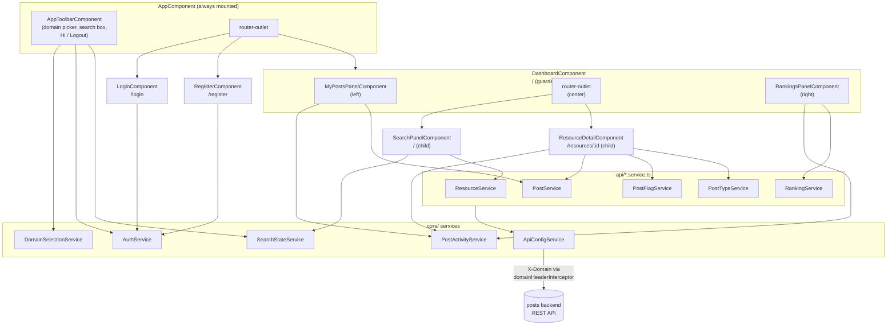

# imdb-ui-angular — Architecture

Current-state architecture reference for this app: how it's structured,
how it talks to the backend, and — the main thing worth understanding
before changing anything — how one build serves more than one domain from
a runtime picker instead of being hardcoded to `imdb/bigotry`.

This is *not* the product/UX spec. For screens, flows, and business-rule
decisions, see [`design-spec.md`](./design-spec.md). For installing,
running, and troubleshooting this app locally, see
[`running-locally.md`](./running-locally.md). For the backend API this app
consumes, see [`backend/posts/docs/architecture.md`](../../../backend/posts/docs/architecture.md).

## Table of Contents

- [1. What This App Is](#1-what-this-app-is)
- [2. Component Architecture](#2-component-architecture)
- [3. Routing & Navigation](#3-routing--navigation)
- [4. Domain Configuration System](#4-domain-configuration-system)
- [5. State Management](#5-state-management)
- [6. API Layer & Runtime Configuration](#6-api-layer--runtime-configuration)
- [7. Auth](#7-auth)
- [8. Testing](#8-testing)
- [9. Deployment](#9-deployment)
- [10. TODO / Future Work](#10-todo--future-work)
- [11. Related Documents](#11-related-documents)

## 1. What This App Is

[↑ Back to Table of Contents](#table-of-contents)

An Angular 22 single-page app (standalone components, Signals,
`ChangeDetectionStrategy.OnPush` throughout) for the `posts` backend's
threaded-post/flag domains. One build serves **every configured domain**
from a runtime picker in the toolbar — today `imdb/bigotry` ("Big-O-Meter",
severity-scored bigotry flags) and `imdb/standard` ("Movie-Meter", a plain
rating), both live.

Domain-specific behavior — rating mode, badge coloring, conflict-detection
rules, skin — is isolated behind one `DomainConfig` object per domain
([§4](#4-domain-configuration-system))
rather than scattered through components as hardcoded `imdb/bigotry`
logic. That seam is this app's main architectural idea, and it mirrors the
backend's own domain-scoping design
([`backend/posts/docs/architecture.md`](../../../backend/posts/docs/architecture.md) §8).

## 2. Component Architecture

[↑ Back to Table of Contents](#table-of-contents)

## 3. Routing & Navigation

[↑ Back to Table of Contents](#table-of-contents)

| Path | Component | Guard |
|---|---|---|
| `/login` | `LoginComponent` | — |
| `/register` | `RegisterComponent` | — |
| `/` | `DashboardComponent` → child `SearchPanelComponent` | `authGuard` |
| `/resources/:id` | `DashboardComponent` → child `ResourceDetailComponent` | `authGuard` |
| `**` | redirects to `/` | — |

`DashboardComponent` mounts once and stays mounted across both of its
child routes — only the center `<router-outlet>` swaps between search
results and a resource's detail view. This is what keeps the left
(my-posts) and right (rankings) panels visible and un-reloaded while
viewing a resource, rather than replacing the whole page. All routes are
lazy-loaded via `loadComponent`. `authGuard` (`core/auth.guard.ts`)
redirects to `/login` whenever `AuthService.currentUser()` is unset.

## 4. Domain Configuration System

[↑ Back to Table of Contents](#table-of-contents)

Everything about a domain's behavior and appearance lives in one
`DomainConfig` object (`core/domain/domain-config.model.ts`):

| Field | Purpose |
|---|---|
| `value` | The `X-Domain` header value / picker key (e.g. `imdb/bigotry`). |
| `label`, `description`, `enabled` | Picker copy; `enabled: false` reserves a domain's slot without making it selectable. |
| `rating.mode` | `'severity-score'` (a 0–5 score field) or `'category-only'` (no score field shown). |
| `rating.severity` / `rating.fixedScoreValue` | The score range + "severe" threshold for `severity-score`; the constant score every flag submits for `category-only` (the backend's `post_flag.score` is still `NOT NULL` — see [`design-spec.md`](./design-spec.md) §4). |
| `badgeClassFor(postTypeName, score)` | Maps a flag to a CSS badge class. |
| `neutralPostTypeName` | The one post type this domain treats as "neutral" (bigotry's `no-bigotry`), or `null`. Drives whether the conflicting-post dialog and ranking post-processing below are active at all. |
| `postProcessRankings?(rankings, postService)` | Optional client-side ranking-list filter (bigotry's severity-based no-bigotry filtering). Most domains omit it. |
| `findConflictingPosts` / the conflict dialog | Bigotry-specific cross-post business rule, wired through `neutralPostTypeName` rather than a magic string comparison. |
| `themeTokens` | CSS custom-property overrides applied to `:root` while this domain is active — the domain's entire skin. Bigotry uses `{}` since its colors *are* `styles.css`'s base `:root` values (it's the default domain). |

Every config is registered in `core/domain/domain-registry.ts`'s
`DOMAIN_REGISTRY` array (currently `IMDB_BIGOTRY_CONFIG`,
`IMDB_STANDARD_CONFIG`). `domain-options.ts`'s `DOMAIN_OPTIONS` (picker
label/description/enabled) is *derived* from that registry, never
hand-maintained.

```mermaid
flowchart LR
    Picker["Toolbar domain <select>"] -->|select domain| DomainSel["DomainSelectionService"]
    DomainSel -->|persists to| Storage[("localStorage")]
    DomainSel -->|computed| Active["activeDomainConfig"]
    Active -->|effect: apply| Root[":root CSS custom properties"]
    Active -->|rating.mode, badgeClassFor,\nneutralPostTypeName, ...| Components["ResourceDetail, SearchPanel,\nRankingsPanel"]
    DomainSel -->|selectedDomain| Interceptor["domainHeaderInterceptor"]
    Interceptor -->|X-Domain header| Backend[("posts backend")]
```

`DomainSelectionService.select()` also logs the current user out and
redirects to `/login` on a domain switch — accounts are domain-scoped on
the backend, so a session can't carry across domains. Because the
theme-applying `effect()` reacts to the same `selectedDomain` signal, the
`/login` page the user lands on already renders in the new domain's skin.

**Adding a domain** is one new file under `core/domain/configs/`
implementing `DomainConfig`, plus one line in `DOMAIN_REGISTRY` — no other
file needs a manual edit. The matching backend-side step (seeding the
domain's `resource_category`/`post_type` rows) is described in
[`backend/posts/docs/architecture.md`](../../../backend/posts/docs/architecture.md) §8.3.

## 5. State Management

[↑ Back to Table of Contents](#table-of-contents)

No store library — cross-component state lives in `providedIn: 'root'`
services backed by Signals, read directly in templates/computed values:

- **`AuthService`** — the logged-in user, mirrored to `localStorage` ([§7](#7-auth)).
- **`DomainSelectionService`** — the active domain and its config ([§4](#4-domain-configuration-system)).
- **`SearchStateService`** — search results/loading/error state. Exists
  because the search box lives in the always-mounted toolbar but its
  results render in the dashboard's routed center panel — two different
  components that need to share state neither one owns. Resets on every
  `currentUser()` transition (login/logout/register) so a new session
  never inherits another session's or another domain's stale results.
- **`PostActivityService`** — a single "something changed" counter signal.
  The left/right dashboard panels load their data once and stay mounted
  across navigation, so they have no other way to learn that a post was
  just created on the routed `ResourceDetailComponent` child page.

Some UI state is intentionally *not* here: dashboard panel widths and the
resource-detail post-table's column width are per-viewer layout prefs
persisted straight to `localStorage` from the components that own them —
reasonable since nothing else needs to see them, unlike the state above.

## 6. API Layer & Runtime Configuration

[↑ Back to Table of Contents](#table-of-contents)

`api/*.service.ts` — one thin `HttpClient` wrapper per backend aggregate
(`ResourceService`, `PostService`, `PostFlagService`, `PostTypeService`,
`RankingService`), each returning TypeScript interfaces that mirror the
backend's response DTOs.

Two interceptors (registered in `app.config.ts`) apply to every request:

- **`domainHeaderInterceptor`** — adds `X-Domain: <selectedDomain>` ([§4](#4-domain-configuration-system)).
- **`errorInterceptor`** — unpacks the backend's RFC 7807 `ProblemDetail`
  body into an `AppHttpError` with a ready-to-display message, so
  components never parse an error body themselves.

**The backend base URL is resolved at runtime, not baked in at build
time.** Every `api/*.service.ts` reads `ApiConfigService.baseUrl()`
instead of a hardcoded constant. `ApiConfigService` defaults to
`API_BASE_URL` (`http://localhost:8080`) and is overridden by a
`provideAppInitializer` (`loadApiConfig()`) that fetches `/config.json`
before the app finishes bootstrapping — that file is generated at
*container startup* by `docker-entrypoint.sh` from an `API_BASE_URL` env
var ([§9](#9-deployment)), not at `ng build` time. One built Docker image can therefore
point at any backend URL without a rebuild. In unit tests, the app
initializer never runs (`TestBed` doesn't invoke
`bootstrapApplication`'s providers), so `baseUrl()` always resolves to the
`API_BASE_URL` constant — specs assert against that value directly.

## 7. Auth

[↑ Back to Table of Contents](#table-of-contents)

Placeholder auth, matching the backend's explicitly not-security-enforced
posture ([`backend/posts/docs/architecture.md`](../../../backend/posts/docs/architecture.md) §5, §9.2) — no
password/session/token:

- **Login** — `AuthService.login(username)` calls
  `GET /dev/users/by-username/{username}`; `404` means no account.
- **Register** — `AuthService.register(username, email)` calls
  `POST /dev/users`; `409` on a duplicate username/email.
- Either way, the returned account is stored in a signal and mirrored to
  `localStorage` so a page refresh doesn't log the user out. Every
  subsequent API call sends `id`/`username` exactly where the target DTO
  already expects a `userId`/`username` field — no token, no
  `Authorization` header.

`AuthService`'s public shape (`login`/`register`/`logout`/`currentUser`)
is deliberately IdP-agnostic: swapping in a real provider later only
changes what happens *inside* `login`/`register`, not who calls them or
what they return.

## 8. Testing

[↑ Back to Table of Contents](#table-of-contents)

`ng test` runs the full Vitest suite (services, interceptors, guards,
every component) against `HttpClientTesting` — no backend required. See
[`running-locally.md`](./running-locally.md) for commands.

## 9. Deployment

[↑ Back to Table of Contents](#table-of-contents)

Multi-stage `Dockerfile`: build the Angular app with Node, serve the
static output (`dist/imdb-ui-angular/browser`) with nginx. At container
*startup*, `docker-entrypoint.sh` writes `/config.json` from the
`API_BASE_URL` env var before nginx starts ([§6](#6-api-layer--runtime-configuration)) — the same built image
works against any backend without rebuilding. Full stack wiring
(`FRONTEND_PORT`, CORS origin, compose service definition):
[root `CLAUDE.md`](../../../CLAUDE.md) / [root `README.md`](../../../README.md).

## 10. TODO / Future Work

[↑ Back to Table of Contents](#table-of-contents)

- **Live updates for `PostActivityService` ([§5](#5-state-management)).**
  Right now the left/right dashboard panels only learn a post/flag changed
  when the routed `ResourceDetailComponent` bumps the same signal from
  inside this tab — another tab, another user, or a change made anywhere
  else is invisible until a manual refresh. Two options, not yet decided
  between:
  - **Polling** — cheapest to add (an interval-driven refetch behind the
    existing `PostActivityService` signal), but adds constant request
    volume and a visible staleness window.
  - **WebSockets** — push-based, no staleness window, but needs a
    connection channel through the backend (which currently has no
    push/session infrastructure at all — see
    [`backend/posts/docs/architecture.md`](../../../backend/posts/docs/architecture.md))
    and reconnect/backoff handling on this side.

## 11. Related Documents

[↑ Back to Table of Contents](#table-of-contents)

| Document | Covers |
|---|---|
| [`design-spec.md`](./design-spec.md) | Screens, flows, decision log, domain-specific business rules |
| [`user-guide.md`](./user-guide.md) | Screenshot-driven walkthrough for end users of the app itself |
| [`running-locally.md`](./running-locally.md) | Installing, running, testing, and troubleshooting this app |
| [`backend/posts/docs/architecture.md`](../../../backend/posts/docs/architecture.md) | The REST API this app consumes, and the backend's own multi-domain design |
