# User Guide

A walkthrough of everything you can do in the app, for both of the
communities it currently hosts: **Big-O-Meter** and **Movie-Meter**. If
you're looking for how the app is built instead of how to use it, see
[`architecture.md`](./architecture.md) and
[`design-spec.md`](./design-spec.md).

## Table of Contents

- [1. What Is This App?](#1-what-is-this-app)
- [2. Getting Started](#2-getting-started)
  - [2.1 Choosing a Community](#21-choosing-a-community)
  - [2.2 Creating an Account](#22-creating-an-account)
  - [2.3 Signing In](#23-signing-in)
- [3. Big-O-Meter](#3-big-o-meter)
  - [3.1 What It's For](#31-what-its-for)
  - [3.2 The Dashboard](#32-the-dashboard)
  - [3.3 Searching for a Title](#33-searching-for-a-title)
  - [3.4 Viewing a Title](#34-viewing-a-title)
  - [3.5 Posting About a Title](#35-posting-about-a-title)
  - [3.6 Replying to a Post](#36-replying-to-a-post)
  - [3.7 Rankings: Top 5 by Category](#37-rankings-top-5-by-category)
  - [3.8 My Posts and My Replies](#38-my-posts-and-my-replies)
- [4. Movie-Meter](#4-movie-meter)
  - [4.1 What It's For](#41-what-its-for)
  - [4.2 The Dashboard](#42-the-dashboard)
  - [4.3 Searching for a Title](#43-searching-for-a-title)
  - [4.4 Viewing a Title](#44-viewing-a-title)
  - [4.5 Rating a Title](#45-rating-a-title)
  - [4.6 Replying to a Post](#46-replying-to-a-post)
  - [4.7 Rankings: Top 5 by Category](#47-rankings-top-5-by-category)
  - [4.8 My Posts and My Replies](#48-my-posts-and-my-replies)
- [5. Switching Communities](#5-switching-communities)
- [6. Your Session](#6-your-session)
- [7. Tips & Troubleshooting](#7-tips--troubleshooting)

## 1. What Is This App?

[↑ Back to Table of Contents](#table-of-contents)

This app hosts more than one community, each with its own way of rating
movies, TV shows, and other titles. A picker in the top-right corner
switches which one you're using. Today there are two:

| Community | What it's about |
|---|---|
| **Big-O-Meter** | Flags titles for potentially biased content — racism, sexism, and LGBTQ+-phobia — and rates how severe each flag is. |
| **Movie-Meter** | A general-purpose rating: skip it, it was okay, I enjoyed it, or I loved it. No severity, just your pick. |

Both work the same way underneath — you search a catalog of titles, post
about them, optionally attach a rating, reply to other people's posts, and
see which titles are trending in each rating category. What differs is
*what the rating means* and how it's labeled — covered separately in
[§3](#3-big-o-meter) and [§4](#4-movie-meter) below.

## 2. Getting Started

[↑ Back to Table of Contents](#table-of-contents)

> [!WARNING]
> **Use a private/incognito browser window for the best experience.**
> Your session and domain choice persist to `localStorage`, so a regular
> window may carry over a login or domain from a previous visit.
> Incognito gives you a clean slate — handy for trying different
> communities or the different mock users below.

### 2.1 Choosing a Community

[↑ Back to Table of Contents](#table-of-contents)

The **Domain** picker in the top-right corner of every screen selects
which community you're using. It's visible even before you sign in, so
you can pick your community first, then sign in or register within it.

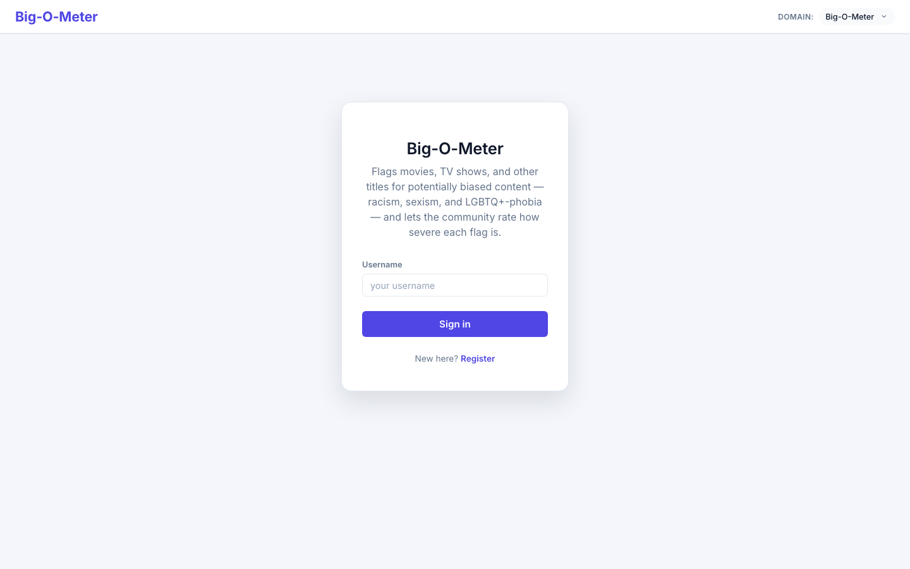

Accounts belong to exactly one community — signing in as `user1` on
Big-O-Meter and signing in as `user1` on Movie-Meter are two entirely
separate accounts, even though they share a username. Switching
communities while signed in automatically signs you out
([§5](#5-switching-communities)) so you're
never accidentally posting to the wrong one.

### 2.2 Creating an Account

[↑ Back to Table of Contents](#table-of-contents)

Click **Register** from the sign-in screen. You'll need a username and an
email address — no password is required at this stage.

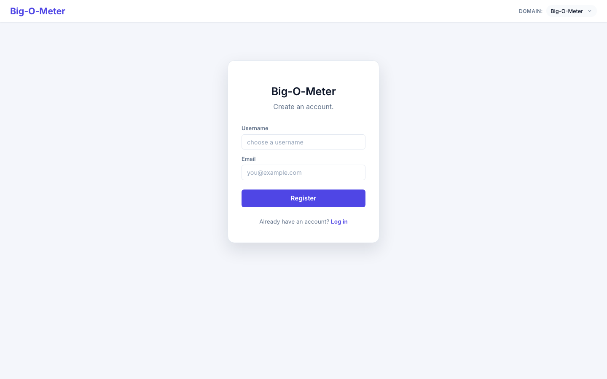

Once you register, you're signed in immediately — there's no separate
"now go sign in" step. If the username or email is already taken in that
community, you'll see an error and can try again.

### 2.3 Signing In

[↑ Back to Table of Contents](#table-of-contents)

Already have an account in the selected community? Enter your username
and click **Sign in**. If nothing matches, you'll see "no account found" —
double check the community picker is set to the right one, since the same
username can exist in one community and not the other.

Once signed in, you'll land on the dashboard, and your session is
remembered — closing the tab and coming back later keeps you signed in.

## 3. Big-O-Meter

[↑ Back to Table of Contents](#table-of-contents)

### 3.1 What It's For

[↑ Back to Table of Contents](#table-of-contents)

Big-O-Meter is for flagging movies, TV shows, and other titles for
potentially biased content, and discussing why. Every post can optionally
carry one flag: a **category** (racism, sexism, LGBTQ+-phobic, or
no-bigotry) and a **severity score from 0 (neutral) to 5 (most severe)**.
A single title can accumulate many flags from many people — the app shows
you the average severity per category.

### 3.2 The Dashboard

[↑ Back to Table of Contents](#table-of-contents)

After signing in, you land on a three-panel dashboard:

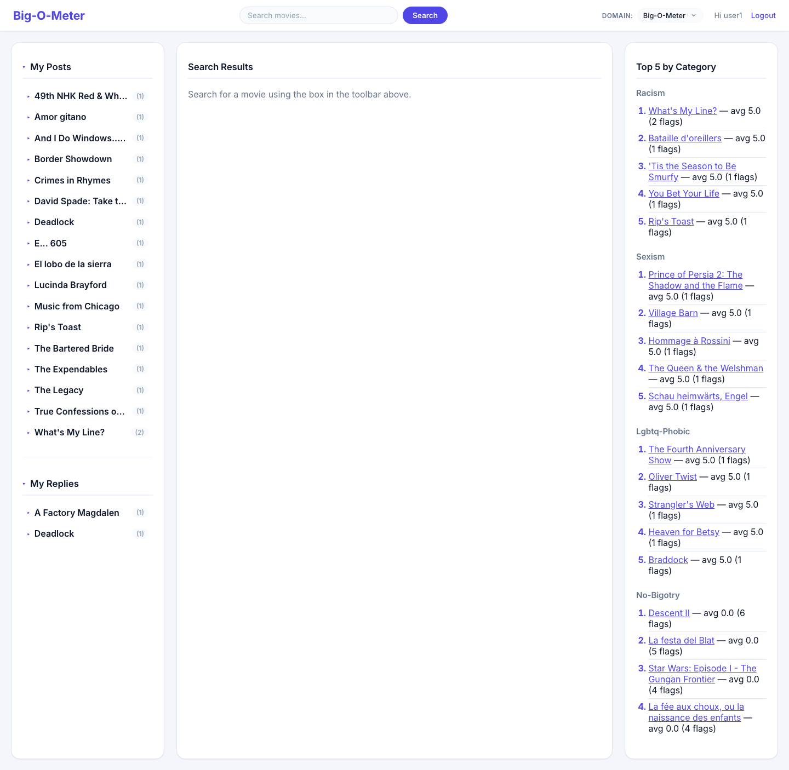

- **Left — My Posts / My Replies**: everything you've personally posted
  or replied to, grouped by title ([§3.8](#38-my-posts-and-my-replies)).
- **Center**: search results, or a title's own page once you click into
  one.
- **Right — Top 5 by Category**: the most-flagged titles per bigotry
  category, ranked by average severity
  ([§3.7](#37-rankings-top-5-by-category)).

The divider between panels can be dragged (or resized with the arrow keys
when focused) if you want more room for one side.

### 3.3 Searching for a Title

[↑ Back to Table of Contents](#table-of-contents)

Type into the search box in the toolbar (visible on every screen) and
press **Search**. Matching is a simple partial, case-insensitive match on
the title — there's no auto-complete, so press Enter or click Search once
you're done typing.

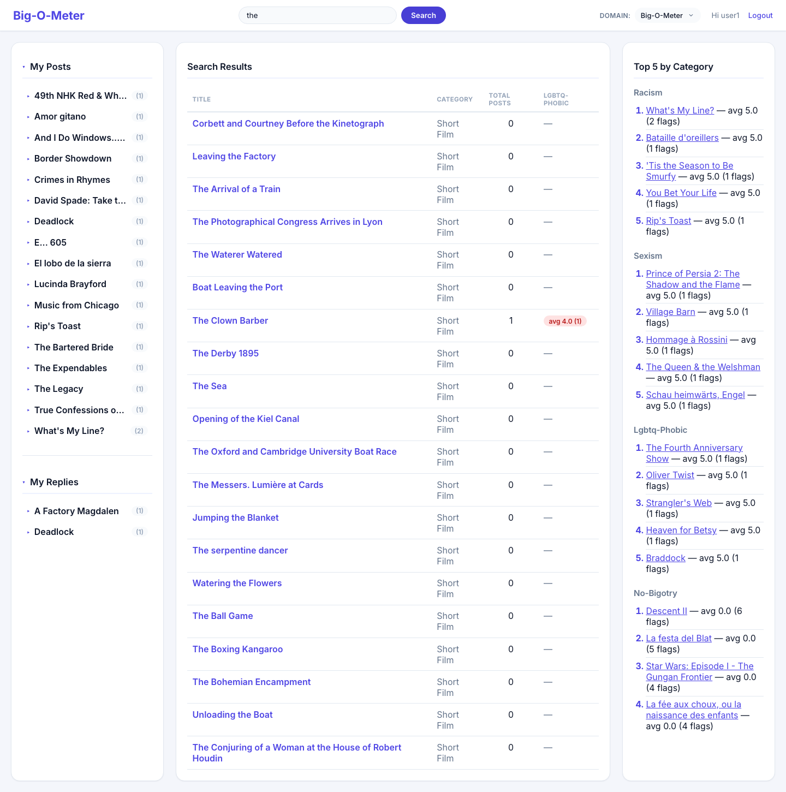

Each result shows its category (movie, TV series, short film, etc.), how
many posts it has in total, and a column per bigotry category that has at
least one active flag on any result — so the columns shown adjust to
whatever's actually been flagged.

### 3.4 Viewing a Title

[↑ Back to Table of Contents](#table-of-contents)

Click a result to open its page: a summary of its flags, a form to add
your own post, and the full list of posts against it.

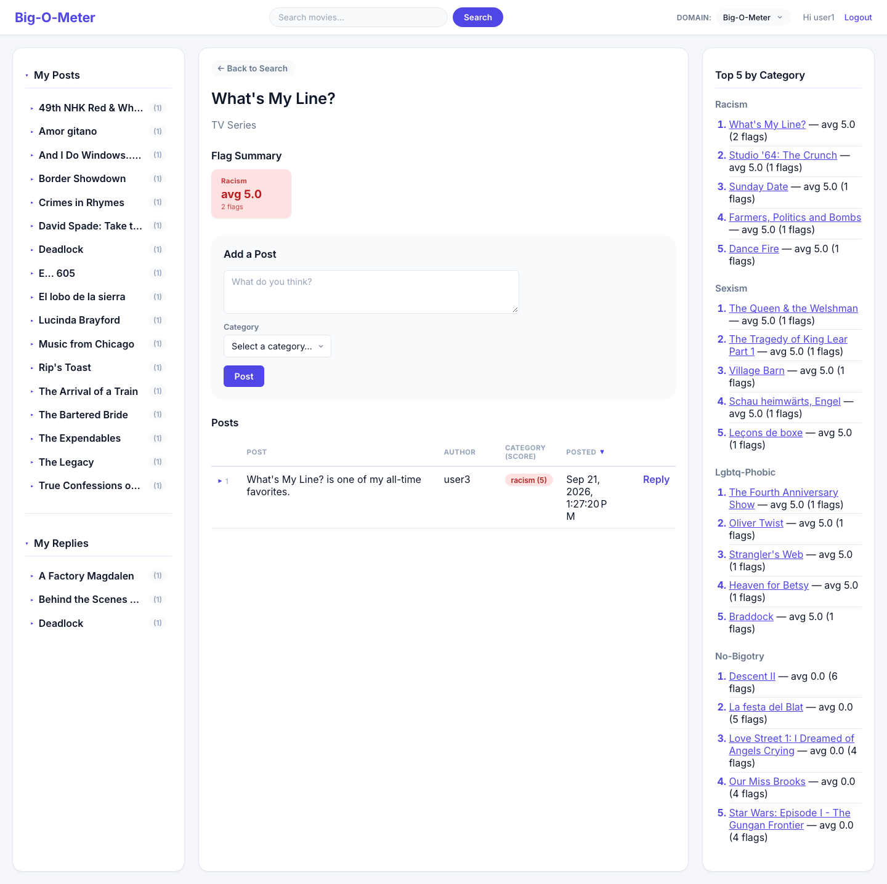

The **Flag Summary** at the top shows one card per category that's been
used, with the average severity and how many flags make up that average.
Below that, every post is listed with its author, its flag (if any), and
when it was posted. A post with replies shows a count you can click to
expand:

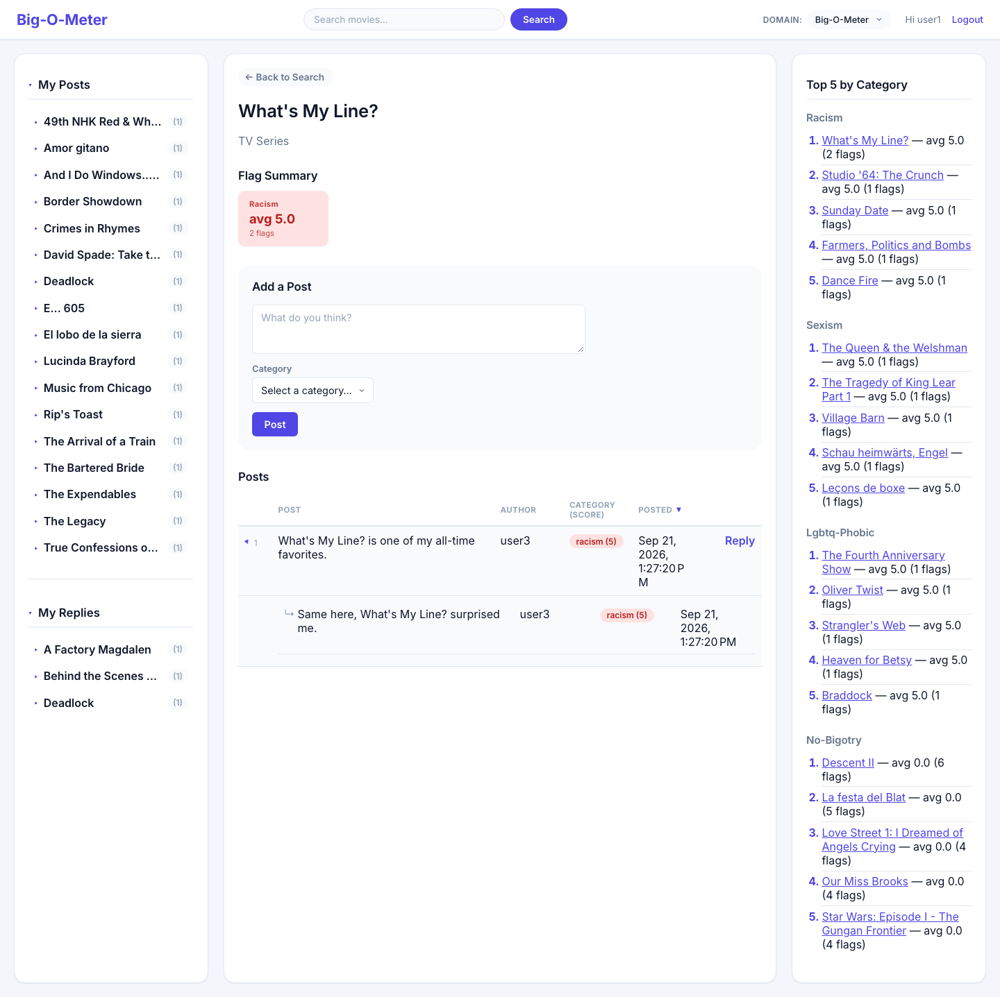

### 3.5 Posting About a Title

[↑ Back to Table of Contents](#table-of-contents)

Use the **Add a Post** box on a title's page. Write your post, and
optionally pick a category — if you do, a severity field (0 = neutral, 5 =
most severe) appears for you to set:

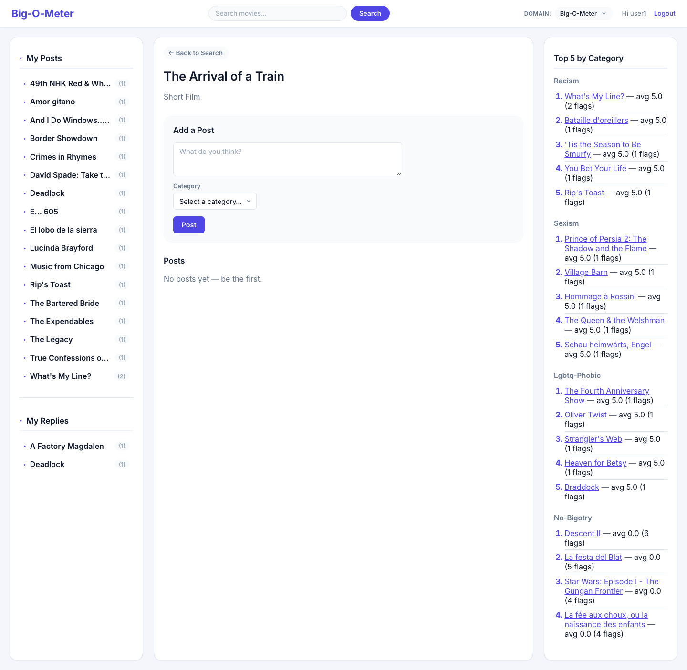

Submit, and your post appears immediately at the top of the list with its
flag badge:

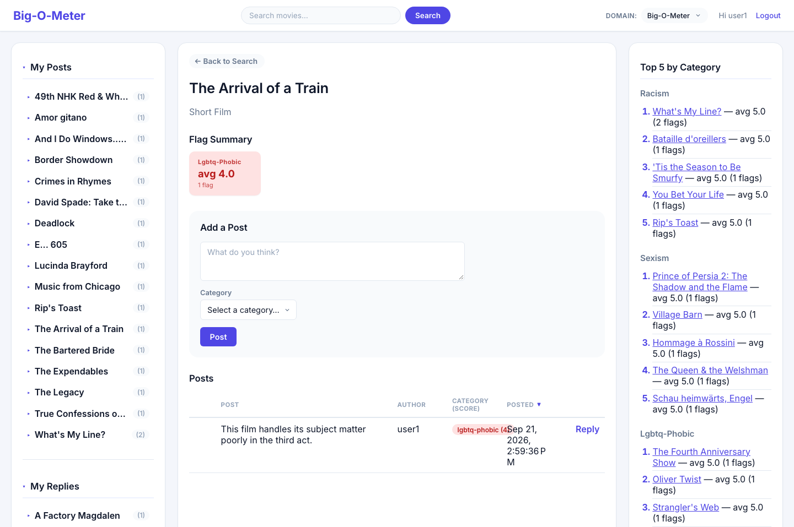

You can leave the category blank to just post a comment with no flag
attached.

**One special rule:** if you flag a title **no-bigotry** while you (or
your post) already has a *severe* bigotry flag on it — or the other way
around — you'll be asked to resolve the contradiction: either remove the
conflicting post(s), or keep them and discard the one you just wrote.
Both can't stand at once.

### 3.6 Replying to a Post

[↑ Back to Table of Contents](#table-of-contents)

Click **Reply** under any post to open a reply form right there in the
thread. A reply can carry its own category and severity, independent of
the post it's replying to — or none at all:

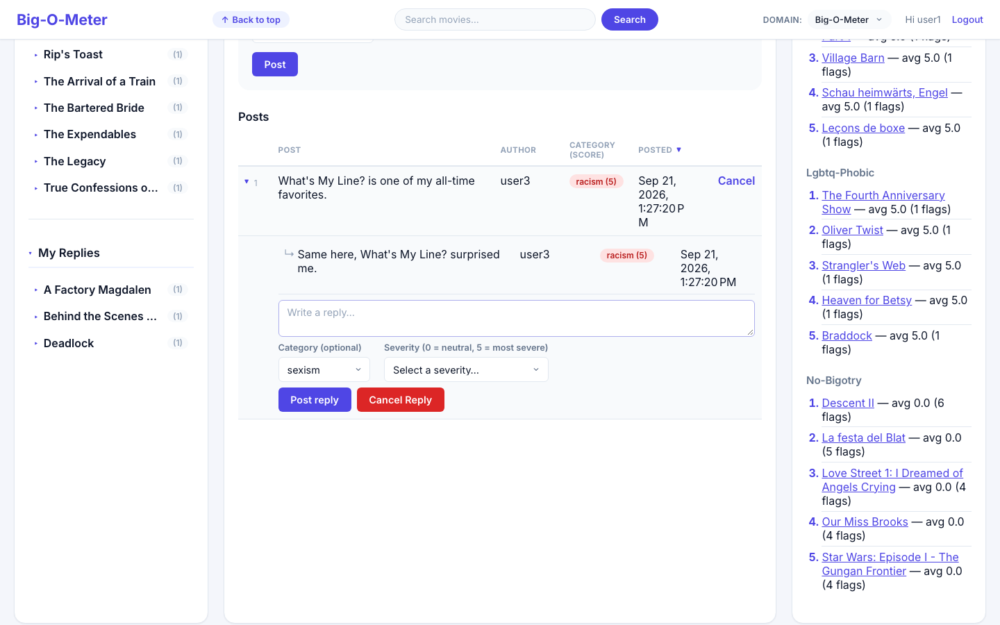

Click **Post reply** to submit, or **Cancel Reply** to close the form
without posting.

### 3.7 Rankings: Top 5 by Category

[↑ Back to Table of Contents](#table-of-contents)

The dashboard's right panel lists, for each bigotry category, the 5
titles with the highest average severity among their active flags in that
category:

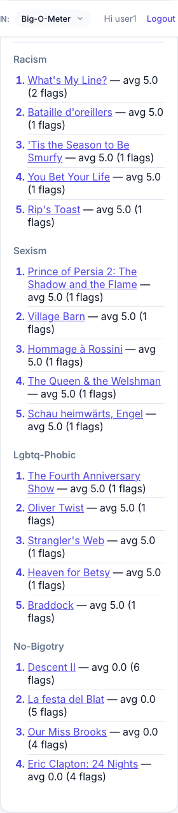

A title needs at least one flag in a category to show up there at all —
"No-Bigotry" behaves the same way, ranking titles most consistently
flagged clean.

### 3.8 My Posts and My Replies

[↑ Back to Table of Contents](#table-of-contents)

The dashboard's left panel is your own personal record: every top-level
post you've made, and every reply, grouped by the title they're on.
Clicking any entry jumps you straight to that post on its title's page.

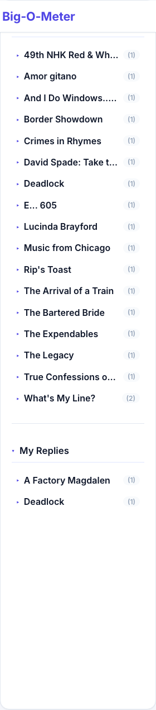

Click a title's row to expand or collapse the posts under it. Long posts
are clipped with a "… more" link so the list stays scannable.

## 4. Movie-Meter

[↑ Back to Table of Contents](#table-of-contents)

### 4.1 What It's For

[↑ Back to Table of Contents](#table-of-contents)

Movie-Meter is a plain rating community — no severity, no categories to
weigh against each other. You pick one of four reactions for a title:
**Skip-It**, **It-Was-Okay**, **I-Enjoyed-It**, or **I-Loved-It**. There's
no score to argue about, just how many people picked each option.

### 4.2 The Dashboard

[↑ Back to Table of Contents](#table-of-contents)

The same three-panel layout as Big-O-Meter, just re-skinned and re-labeled
for this community:

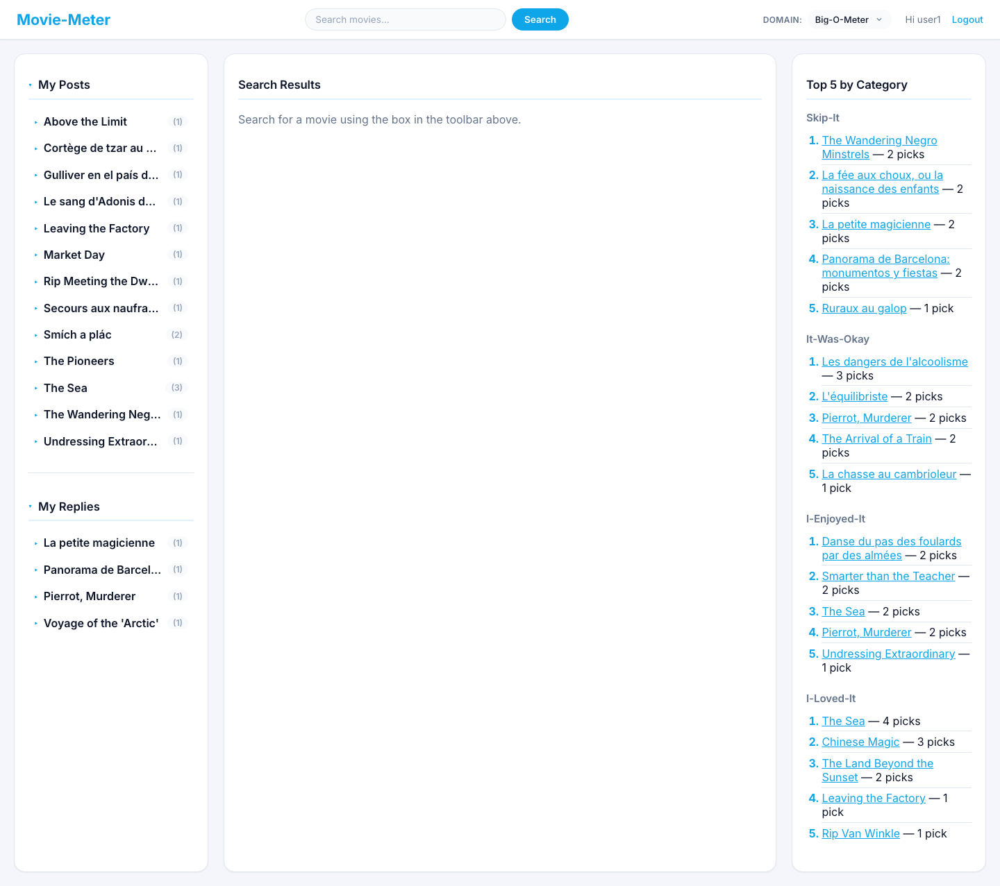

Notice the color scheme is different from Big-O-Meter — each community
has its own look, so it's obvious at a glance which one you're in.

### 4.3 Searching for a Title

[↑ Back to Table of Contents](#table-of-contents)

Search works exactly the same way as Big-O-Meter
([§3.3](#33-searching-for-a-title)) — type a term in
the toolbar and press Search. The results table's rating columns just
show plain counts instead of severity averages:

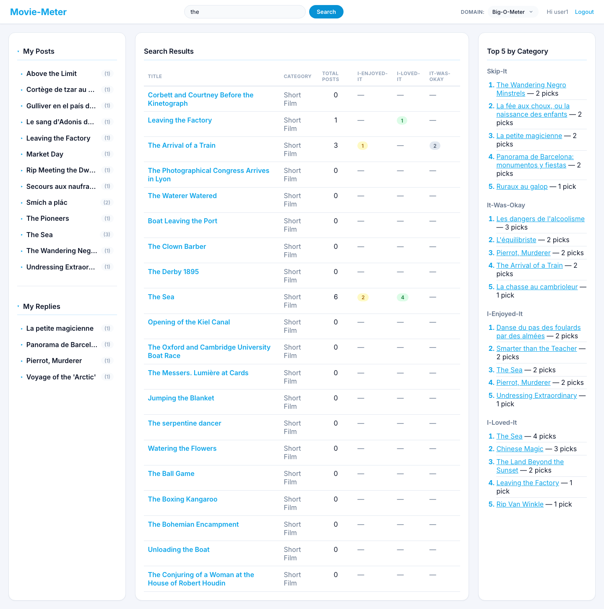

### 4.4 Viewing a Title

[↑ Back to Table of Contents](#table-of-contents)

Click into a title the same way as in Big-O-Meter. The Flag Summary shows
a count instead of an average score, since there's no severity to average:

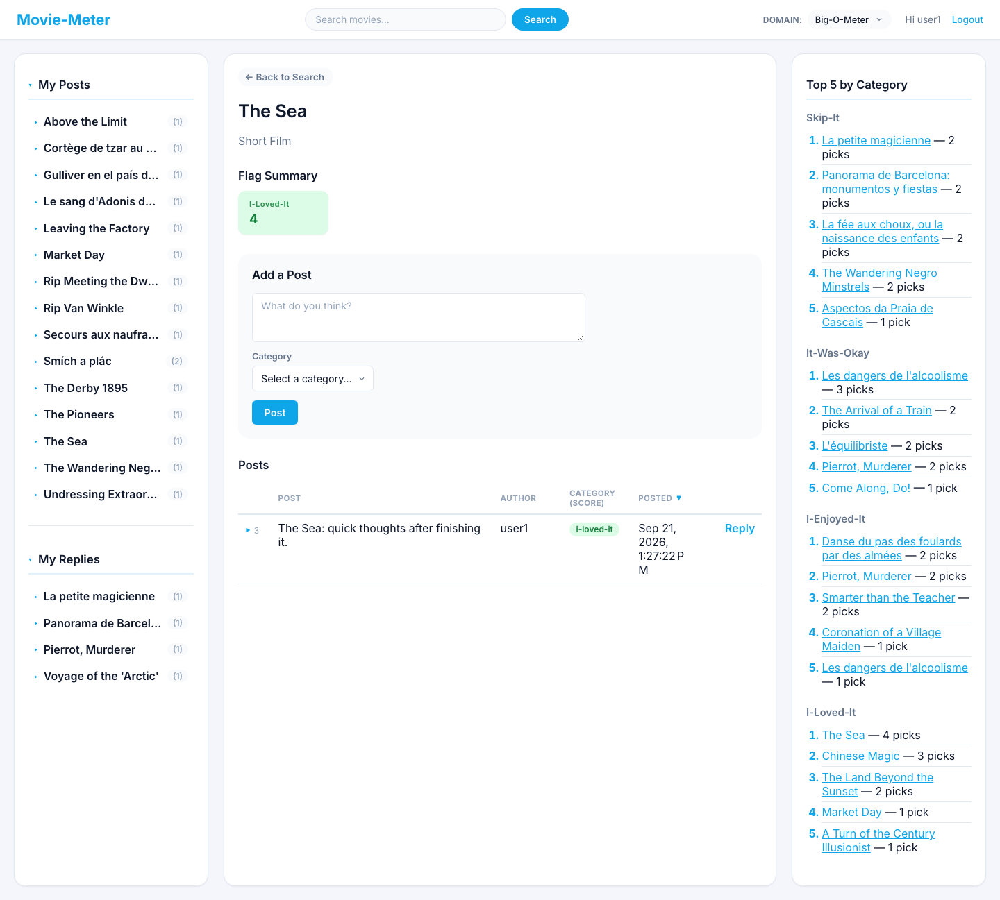

Threads work identically — click a post to expand its replies:

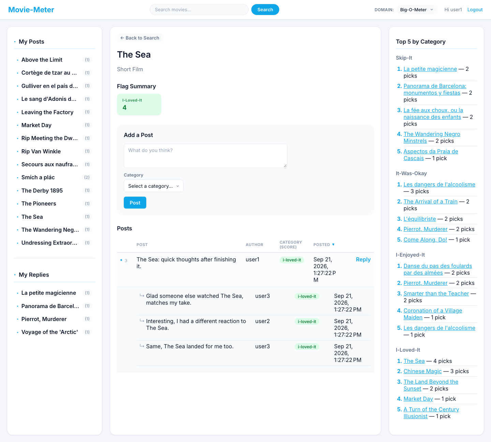

### 4.5 Rating a Title

[↑ Back to Table of Contents](#table-of-contents)

Same **Add a Post** box as Big-O-Meter, but the category picker is the
only rating control — there's no severity field to fill in, since a
rating here is just a pick, not a score:

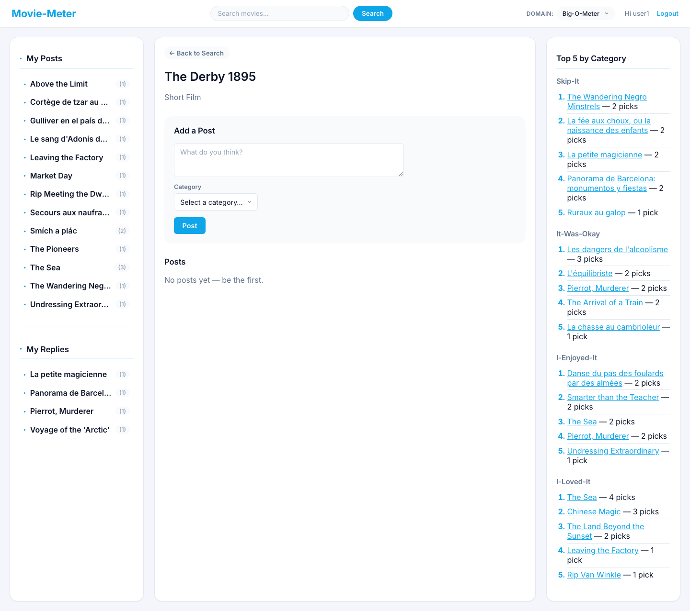

After submitting, your post and its rating badge appear at the top of the
list:

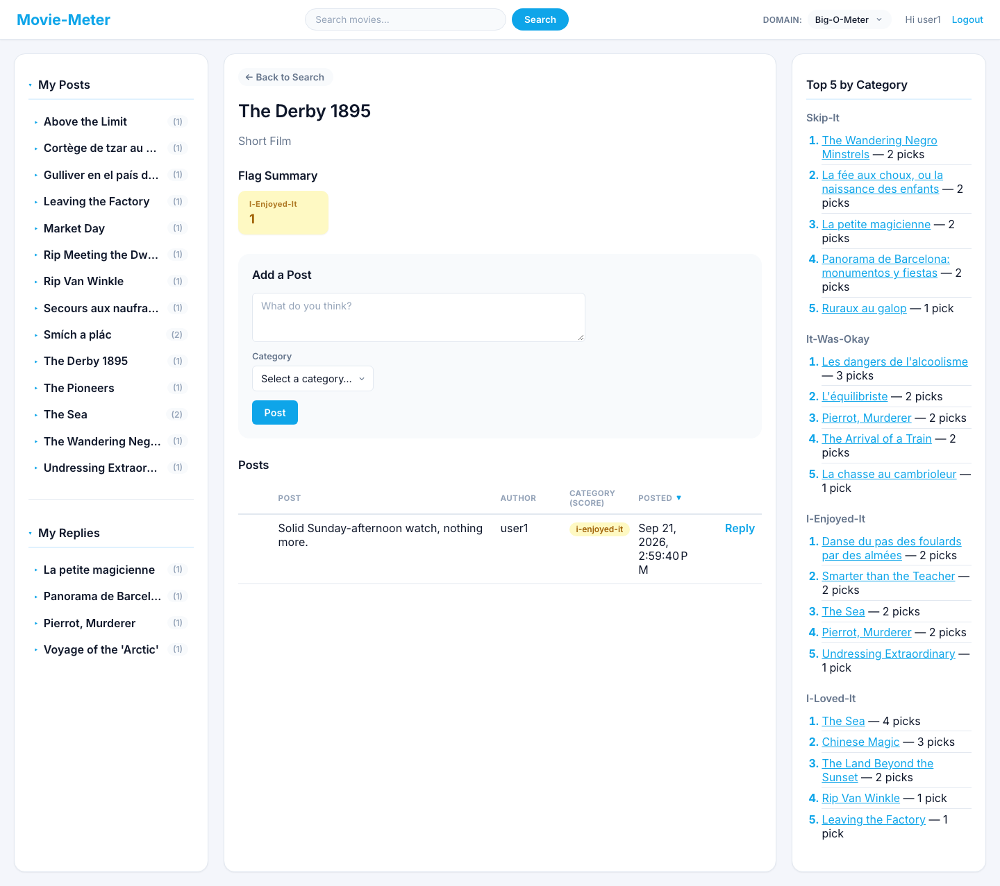

Movie-Meter has no "conflicting rating" rule — pick whatever category
fits, as many times on as many titles as you like.

### 4.6 Replying to a Post

[↑ Back to Table of Contents](#table-of-contents)

Works the same as Big-O-Meter's replies
([§3.6](#36-replying-to-a-post)): click **Reply**, write
your response, optionally pick a category, and submit — no severity field
to worry about here either.

### 4.7 Rankings: Top 5 by Category

[↑ Back to Table of Contents](#table-of-contents)

The right panel again shows the top 5 titles per category, but ranked by
how many people picked that category rather than by an average score —
"picks," not "avg":

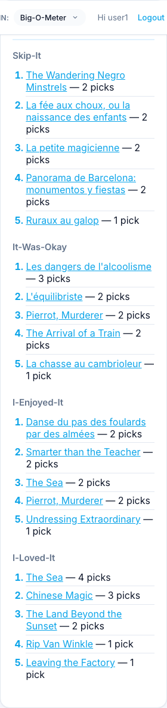

### 4.8 My Posts and My Replies

[↑ Back to Table of Contents](#table-of-contents)

Identical in behavior to Big-O-Meter's
([§3.8](#38-my-posts-and-my-replies)) — your own posts and
replies, grouped by title, on the dashboard's left panel:

## 5. Switching Communities

[↑ Back to Table of Contents](#table-of-contents)

Pick a different option from the **Domain** dropdown in the toolbar at
any time. If you're signed in, this signs you out immediately and sends
you to the sign-in screen — already re-skinned for the community you just
switched to:

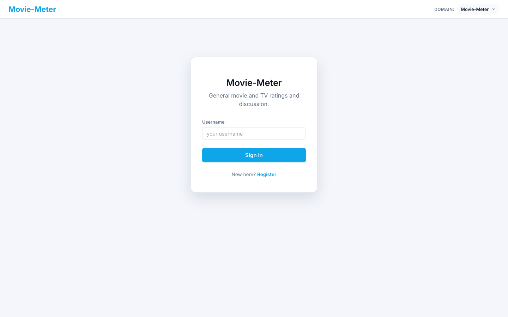

From there, sign in or register the same way as
[§2](#2-getting-started) — remember, your
Big-O-Meter account and your Movie-Meter account are separate, even with
the same username.

A community shown greyed out with "(coming soon)" in the picker has been
reserved but doesn't have data yet — it isn't selectable.

## 6. Your Session

[↑ Back to Table of Contents](#table-of-contents)

There's no password on either community — signing in just looks up your
account by username. Your session is remembered in your browser, so
reopening the app later keeps you signed in without asking again. Click
**Logout** in the toolbar (next to your username) to end it manually.

Because there's no password, anyone who knows a username could sign in as
that account. Don't use this app for anything you wouldn't want a
stranger with a lucky guess to see or post as you.

## 7. Tips & Troubleshooting

[↑ Back to Table of Contents](#table-of-contents)

- **"No account found" when signing in** — check the Domain picker is set
  to the community you actually registered in; the same username can
  exist in one and not the other.
- **A community's registration says the username or email is already
  taken** — usernames and emails are unique per community, not globally;
  pick a different one, or sign in instead if it's actually your account.
- **Search returns nothing** — search matches the title text itself, not
  genre, category, or flag content; try a shorter or more common term.
- **A title has no rating columns / an empty Flag Summary** — no one has
  posted a flag or rating against it yet; be the first
  ([§3.5](#35-posting-about-a-title)/[§4.5](#45-rating-a-title)).
- **The dashboard panels look empty right after switching communities or
  signing in** — give the page a moment to load; each panel fetches its
  own data independently.
- **Panel or column sizes reset** — panel widths and the post table's
  column width are remembered per browser, not per account; they won't
  follow you to a different browser or device.
